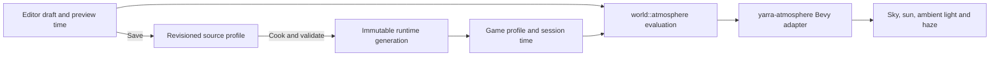

# Atmosphere, sky and weather

Status: first atmosphere authoring slice implemented, 2026-09-19.
See [the authoring guide](ATMOSPHERE_AUTHORING.md) for the editor workflow.

The visual direction is a bright sun embedded in a continuous sky gradient,
sunlit haze, distant scenery fading into the atmosphere, and warm sunrise light
with cooler shadows. The supplied Tsushima images are visual references, not
evidence of its renderer. A large planet and rain remain future work.

## Ownership and data flow

`yarra-atmosphere` owns Bevy sky, sunlight, ambient illumination and aerial
perspective. `yarra-engine` composes it and retains the `WorldEnvironmentPlugin`,
`WorldEnvironmentCamera` and `WorldSun` re-exports. The existing
`yarra-environment` crate owns terrain, vegetation and road authoring.

The pure `world::atmosphere` module contains serializable profiles, validation,
sun-path evaluation and linear-light palette interpolation. Database and cooker
crates depend on those contracts, without depending on Bevy. The atmosphere crate
depends on `world` and Bevy, not SQLite, the editor or terrain/vegetation renderers.

One profile belongs to each world space. It contains an explicit outdoor-sky
policy, startup phase, day length, sun path and disk size, four named lighting
palettes, a moon light and night exposure, molecular scattering, aerosol visibility/tint, exposure and bloom.
Colors are stored as sRGB triples, intensity separately; blending happens in
linear light. The tilted great-circle sun path uses normalized day phase rather
than an Earth calendar. Palette weights depend on solar elevation and whether
the sun is rising or setting, with continuous noon and midnight transitions even
for shallow paths.

No empty subsystem modules are needed yet. Split the runtime adapter into sky,
fog and weather modules when their implementations justify it.

## Rendering

The fixed yellow sphere is replaced by Bevy's atmosphere lookup textures and
`SunDisk`. Sun and moon directional lights supply both sky and surface lighting.
Scattering supplies the solar halo; disk angular size and bloom are independent
controls. Exposure is explicit. Ambient tint/strength is an authored artistic
fill, not a dynamically captured sky environment map.

Molecular density scales the Earth baseline's Rayleigh term. Visibility and haze
tint drive a low-altitude aerosol term, with a 1.2 km exponential height scale.
Aerosol extinction uses 2% contrast at the requested visibility; this is an
optical parameter, not a strict draw-distance cutoff. Dense haze also attenuates
direct sunlight. This first adapter is an Earth-based scattering baseline with
artistic controls; arbitrary alien atmospheric composition is not implemented.

The same atmosphere performs aerial perspective. World cameras remove the old
`DistanceFog` component to avoid applying extinction twice. Custom grass shading
samples atmospheric sun transmittance like Bevy PBR, and its pipeline specializes
for atmosphere-enabled views. Study cameras retain their existing lighting.

The local tangent atmosphere follows the world camera in XZ. Its surface stays
at absolute Y=0, matching the engine's horizontal origin rebasing. This preserves
observer altitude and celestial directions without depending on streamed cells.
The current application has one active world view; independently configured,
simultaneous atmosphere views would need separate media/atmosphere ownership.

Bookmark visibility is a camera override, visibly labelled and clearable in the
editor. It takes precedence over the authored visibility and retains the existing
10–100,000 metre bookmark range; authored visibility is 50–100,000 metres.

## Scheduling and isolation

`AtmosphereOwner` explicitly selects Game, Editor or Study. Editor preview and
the engine's world-profile bridge provide inputs before `ApplyAtmosphere` in
PostUpdate; application runs before transform propagation and render extraction.
Grass reads the strongest visible celestial surface light and shared ambient fill.
It resolves that light in Bevy’s GPU light array before sampling shadows and
atmospheric transmittance; the moon must not sample the sun’s cascades.

Vegetation and Presets studies own their lights while active. World evaluation
is suspended, preview playback pauses, and returning to World reapplies its
profile. Render-audit shadow toggles remain independent. The game's existing `U`
stress test uses an explicit sun-direction override instead of competing writes.

A new game session initializes phase from the published startup setting. Entering
a different world or adopting a generation replaces the profile without resetting
the session phase. Editor Gameplay preview takes an isolated startup snapshot.
Both currently hold that phase fixed; automatic gameplay time is a later feature.
Authoring preview already provides deterministic scrubbing and Play/Pause.

## Night lighting

The Yotei reference guides the first night look: a blue sky/shadow palette with
readable terrain and cool reflective highlights. The existing foliage gloss model
responds to the moon light; material roughness and daytime gloss are unchanged.

`NightLighting` stores a fixed moon heading/elevation, disk size, light tint and
strength, and night EV100. These are independent of the sun path. A smooth weight
from the geometric sunset to -12° solar elevation fades in moonlight and interpolates
exposure in stops, reversing at dawn. Shallow sun paths reach full night at midnight.
An exposure lock captures the currently evaluated exposure, including Published
comparison. Disabling the moon leaves the authored night exposure/ambient fill.

The default is an artistic, readable night, not a simulation of terrestrial lunar
illuminance. The moon disk is currently untextured. Its light affects the atmospheric
sky/haze, ordinary PBR surfaces and custom grass. It is hidden and has zero
illuminance during daytime, in interiors and while study workspaces own lighting.
Its shadow enablement follows the shared sun's render-quality/audit setting. The
second light can add shadow/atmosphere cost at night; sustained GPU measurements
remain outstanding.

## Persistence

Source schema 24 and runtime schema 20 include one validated profile and revision
per world. Reads cap profiles at 4 KiB and world metadata at 32 worlds. Source
writes use expected revisions and an atomic transaction across the requested
worlds. The editor integrates history, recovery journal version 13 (version 12 remains readable), source epochs,
Save and Save & Publish. Preview controls never change authored startup settings.

Cooking hashes the atmosphere parameters into the generation identity even when
cell content is unchanged. It publishes the profile with runtime metadata, outside
cell payloads. The existing exact-generation adoption path supplies the active
profile. Failed publication leaves the previous generation active. Atmosphere
editing does not invalidate terrain/vegetation source previews; publication still
uses the existing full cook.

## Next slices

1. Tune clear, sunrise, sunset and mist appearances on a richer landscape. Measure
   incremental GPU cost before adding expensive effects; no performance claim is
   made by the functional smoke test.
2. Add stable weather-look IDs and condition blending, initially Clear/Misty.
   Weather changes visibility, tint and transmission while retaining the day's
   palette. Local/ground fog can supplement aerial perspective with a distinct role.
3. Add a planet by direction and angular size, lit by the shared sun and composited
   behind atmosphere, clouds and foreground geometry. Orbits, eclipses and reflected
   planet light are separate features.
4. Add the game clock, weather transitions, clouds, rain, wetness and wind consumers.
   Stars, a textured moon, lunar phases and planet appearance remain future work.

The [terrain readiness review](performance/20260919-terrain-review/README.md)
records the existing performance limits and deferred streaming work.
