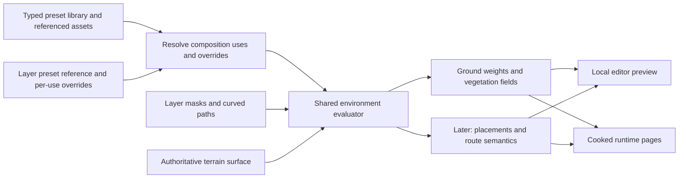

# Environment compositions and spatial authoring

Status: compiler, source persistence, world cooking, viewport painting, typed project
presets, dedicated preset authoring/preview and Nearby / All browsing implemented,
2026-09-18. Preset types own code-defined quick controls and bounded composition uses.
Curved-road source contracts, an offline cart-track compiler fixture, indexed road
persistence and saved-road cooking are also implemented. Road editor controls,
automatic terrain rules, asset
collection scattering and streaming metadata for thousands of layers remain subsequent work.

**Project policy:** no backwards compatibility, legacy-world import, dual source
modes or preservation of the current demo are required. This is an early project;
replace the testing world and obsolete formats when connecting the new workflow.
New formats should be explicit and validated, but they need no migration machinery.

## Implemented compiler slice

- `crates/environment` defines serializable compositions, typed outputs, ordered
  layers, source validation and explicitly loaded coverage cells.
- `crates/environment_compile` builds one validated immutable `CompilePlan` from
  the complete definition catalog, then compiles bounded cell requests against
  `CoverageSnapshot` data. A loaded cell without a layer tile is empty; an unloaded
  dependency is an error. A one-cell halo verifies shared edges and corners.
- Ground weights use stable surface IDs and sum-preserving R8 quantization. Vegetation
  fields use independent stable layer/output/population bindings with scoped internal
  competition. Ground and vegetation are returned together as `CompiledCell`.
- The compiler has explicit material, catalog, field, cell, memory and work limits;
  per-cell dependency fingerprints; and all-or-error batch results. It consumes no
  database, filesystem, ECS or GPU state.
- The fresh two-cell fixture contains two meadow compositions, a sparse hole and a
  winding painted clearing. It uses existing surface IDs and plant definitions as
  reusable assets, with no import of the existing authored world.

Run the focused tests or generate an offline view of the compiled samples:

```sh
cargo test --offline -p yarra-environment -p yarra-environment-compile
cargo run --offline -p yarra-environment-compile --example layered_meadow > /tmp/meadow.svg
```

The SVG is a diagnostic of compiled ground weights and vegetation density, not a
rendered game scene or an implemented road tool. Ground has endpoint samples and
vegetation has centre samples, so their displayed grids have a half-sample offset.
The first viewport painter now uses the same compiler and existing terrain/grass
renderers. The 0.5 m source spacing is a starting point for visual authoring;
interactive brush quality still needs artist feedback.

## Implemented persistence and cooking slice

Project schema **18** stores one small `environment_definitions` catalog per world
space, revisioned `environment_cells`, and R8 tiles in `environment_coverage`.
The reverse index `(world space, layer, cell)` supports keyset dependency queries.
Source terrain palettes/weights and source vegetation field pages were removed,
along with the project migration code. Heightfields, surface assets, plant assets
and manually placed objects retain their own source ownership. Runtime schema 15
and page payload 7 are unchanged.

`ProjectReader::read_environment_snapshot` reads a definition, the plant catalog
and explicitly requested coverage cells in one SQLite snapshot. Absent rows among
those coordinates become known-empty cells with revision zero. A truncated spatial
list never implies empty coverage. Reads cap coordinates and logical query area at
576 cells and tile samples at 4 MiB. A definition is limited to 1 MiB, with at most
32 world definitions and the pure compiler's catalog limits.

`ProjectWriter::apply_environment_source_transaction` saves definitions and coverage
together; the coverage-only API delegates to it. This allows creating a layer and
painting it before Save, or undoing saved paint and removing its layer in one commit.
It acquires an immediate transaction, compares both the cell and definition
revisions, validates the shared-edge/corner halo after applying all edits, and commits
all cells or rolls everything back. A transaction has at most 64 unique cells and
4 MiB of source samples. Erasing drops zero tiles while preserving an empty cell
with an incremented revision: a stale create cannot resurrect erased content.
The painter retains complete gestures and caps the aggregate unsaved area at
64 cells / 3 MiB, so Save commits the complete coverage edit in one transaction.

Definition writes compare the catalog revision and assign new child revisions.
Changing a grid with existing masks or deleting a painted layer is rejected until
its coverage is cleared (possibly in the same transaction). Definition writes have
a separate 4 MiB transaction limit. Plant catalog writes validate composition references.
Dependency queries return the definition revision and a cursor; painting changes
between pages still require their own cell invalidations.

`world_cook` compiles masks through `CompilePlan` before packaging terrain and
vegetation pages. It uses one output cell plus its halo per job, validates source
masks outside terrain as well, and fingerprints the compiled inputs in the published
generation. Population identity now includes the world-space ID; generation catalog
merging also isolates competition groups across worlds. Editor plant-profile preview
uses the same binding/merging path, so streamed field IDs still resolve.

The existing editor working sets, saving, conflict handling and recovery journal
now carry definitions and coverage cells instead of editable render weights. Journal
schema is 7; old journals are not imported. Recovery restores definitions before the
masks that reference them. The Environment inspector edits layers and presets and
controls paint/erase gestures; its rendered preview compiles current source masks.
The separate derived coverage diagnostic remains a summary.

The fresh demo is a 256-cell overworld plus an 81-cell interior. The overworld has
Dry meadow, Green meadow and Clearing layers on a 65-sample source grid. Ground and
vegetation share those masks. Its curved-looking clearing is a sampled fixture,
not an editable road. The interior is a base-surface-only world with no hidden grass.
The smaller fixture replaces the grass performance testing ground; earlier frozen
profiling inputs remain the baseline for those investigations.

Create an independent fresh project without overwriting an existing file:

```sh
cargo run --offline -p yarra-world-cook -- create-demo /tmp/layers.project.sqlite
cargo run --offline -p yarra-world-cook -- cook /tmp/layers.project.sqlite /tmp/layers.runtime.sqlite
```

`demo` still creates a missing project and atomically publishes its runtime. An
existing pre-18 project is rejected explicitly; there is no automatic conversion.
The working `content/demo.project.sqlite` and generated runtime were replaced with
the fresh fixture. A local recovery copy of the previous testing world is at
`tmp/environment-authoring/before-layers.project.sqlite`; none of these databases
are tracked in Git.

Verification covers compiler/cooker parity, deterministic ordering, unpainted base
ground, preservation of manual-object pages, round trips, concurrent writer conflicts,
complete rollback, shared borders, erase tombstones, dependency queries, byte/cell
limits and rejection of obsolete schemas. The painter adds tests for event-frequency
independence, distant shared endpoints, erasing, atomic budget rejection, cancellation,
undo/redo across Save and Publish, stale preview rejection, and brush -> database ->
compiler parity. No sustained GPU performance run is required for these changes.

```sh
cargo test --offline -p yarra-environment -p yarra-environment-compile -p yarra-world-db -p yarra-world-cook -p yarra-vegetation -p yarra-vegetation-compile -p yarra-world
cargo test --offline -p yarra-app-editor --bin yarra-app-editor
```

Final checks for the initial painter slice: **141 focused tests passed**, including 75 editor tests.
The environment, compiler, database and cooker packages pass Clippy with warnings
denied. Editor and game compile without warnings. Strict full-editor Clippy remains
blocked by existing style warnings in the canopy, shell and vegetation-study code;
the new painter modules have no Clippy warnings. The short viewport test below is
functional validation, not a performance benchmark or sustained thermal test.

## Implemented viewport painting slice

In the **World** workspace, choose **Environment** in the World window. The Inspector
lists layers from highest to lowest priority and shows their composition outputs.
Select **Dry meadow**, **Green meadow** or **Clearing**, then drag on resident terrain.
**Paint / Erase**, radius, strength and soft edge apply to the selected layer. Shift
at mouse-down temporarily selects Erase. Erasing reveals lower layers; painting a
lower layer does not remove coverage from a higher layer. The green/orange brush
rings follow terrain; amber indicates a loading or bounded-work condition.

Each drag is one undo command. Escape restores the active gesture, and toolbar Undo
/ Redo (Cmd/Ctrl+Z / Cmd/Ctrl+Shift+Z) replay complete cell records. Strength applies
once per stroke; repeated strokes build coverage, while dwelling or receiving extra
pointer events does not. Each pointer segment paints a continuous capsule. Shared
endpoints use identical logical grid coordinates, including across negative cells,
so fast drags do not leave gaps and adjacent tiles retain exact borders.

The editor queries 5x5 editable cells around the terrain hit plus their 7x7 dependency
halo. A stroke pauses at unloaded cells, outside the supported coordinate/work bounds,
or at its history budget; it never treats unloaded masks as empty. Stroke commands
cap at 64 cells and 6 MiB of before/after samples. The unsaved coverage unit caps at
64 cells / 3 MiB and saves atomically. Dirty, saved-but-unpublished and history-owned
records survive spatial query eviction. The existing 8 MiB / 128-command undo history
and 32 MiB coverage working-set checks bound retained masks; definitions have their
own catalog and transaction limits. Saving, publication and
undo do not interrupt an active stroke; losing focus or switching tools finishes it.

A dedicated worker reads a bounded SQLite halo, overlays local masks, and runs the
same pure compiler as the cooker. Requests hold at most four output cells; only one
job is in flight. Dependency stamps include the definition/plant plan, source-save
epoch, runtime generation and local halo contents. Obsolete results are discarded;
unchanged cells can still accept results while another area is edited. Local overrides
include unsaved undo back to the runtime baseline, even after newer masks were saved.
The previous accepted preview remains visible while a newer draft is pending, and
the Inspector reports pending cells or compilation errors.

Ground and vegetation consume the same accepted `CompiledCell`. The terrain preview
owns and releases temporary materials and weight images as pages unload. Grass also
appears in normal object mode. Leaving World releases its ground overrides; returning
rebuilds them from source. The product cache is capped at 256 nearby resident cells
and a conservative 32 MiB sample budget shared by accepted and staged products. No raster compilation runs in the input
system, and unchanged masks are not cloned/hashed every frame.

**Save** persists applied definitions and coverage together. **Save & Publish** additionally cooks, validates and adopts
an immutable runtime generation, using the existing save coordinator. The working
world is not silently published while painting. Height sculpting, forest/object
scattering and editable curved roads are not implemented yet.

A short native-editor smoke test on 2026-09-17 used disposable database copies under
`tmp/environment-authoring/paint-smoke/`. It verified layer controls, a two-cell
clearing stroke, live ground/grass preview, toolbar undo/redo and Save & Publish.
The runtime adopted generation `c90087cb1171136b` without renderer/worker errors.
The production demo source/runtime were not painted during this test. Keyboard
shortcut combinations were not conclusively exercised by native UI automation;
Escape cancellation and history semantics are covered in automated tests.

## Initial layer and preset editing slice (historical, 2026-09-17)

The Environment Inspector adds **New layer**, name, order (**Up / Down**), enabled
state, opacity and grass amount. A layer references a reusable composition preset.
**New preset** creates a ground-only treatment; **Duplicate preset** makes an
independent copy with new persistent composition/output IDs. Editing a shared
preset affects every layer that references it; the Inspector shows that count.
There is no nested preset graph or separate preset workspace in this implementation.
Compositions are embedded in each world's definition, and layer controls are fixed.
The typed-preset foundation and dedicated workspace below have since replaced those limitations.

A preset can combine ground (up to two existing terrain-pack surfaces and relative
weights), an existing grass assemblage with Add/Replace behavior, and suppression
of lower grass. The current form exposes one grass channel; other channels remain
source/compiler concepts. Plant assets remain managed by the vegetation tools.
Changing grass amount retains a stable subset without altering ground coverage.

**Apply settings** commits the complete form as one undo command; **Discard**
abandons its pending values. While the form is unapplied, painting, layer switching,
save and undo are disabled. Only applied changes enter the recovery journal and
live preview. Layer creation, reordering and enabled-state changes apply immediately
as individual undo steps. Disable a layer to remove its contribution while keeping
its paint; deleting an arbitrary painted layer is not exposed in this first form.
Undoing new-layer creation works after undoing its paint, including across Save.

Definition edits compile all bounded resident preview cells into a staging set.
The previous ground/grass products and their matching population catalog remain
visible until the staged set is complete, then switch together. Obsolete worker
results cannot install a mixed catalog. Each cache reserves half the shared 32 MiB
product budget. A changed external definition conflicts with local definitions or
pinned masks instead of silently rebasing them onto incompatible source.

**Show selected layer coverage** draws the raw mask on loaded terrain: dark is
empty and cyan is full. It temporarily hides grass, shares the terrain mesh, owns
only transient mask images/materials, and does not change authored coverage or
compiled outputs. Unknown cells stay unshaded rather than looking empty. This
shows the selected mask before opacity, exclusions and upper-layer composition.

Regression tests cover creation plus first paint in one commit, rollback of both
on a stale revision or broken edge, clearing paint plus undoing a saved layer,
repeated Save/Undo/Redo, definition-only saves, journal recovery of a new layer and
its mask, and atomic catalog/preview replacement. **145 focused tests passed**, including
78 editor tests. The environment, compiler, database and cooker pass strict Clippy;
editor-wide Clippy still reports existing warnings outside the new authoring modules.
Editor and game compile. No long performance run is needed.

A native-editor smoke test used disposable copies in
`tmp/environment-authoring/layers-smoke/`: new layer, preset duplication/name edit,
painting, raw coverage rendering, Up/Down, disabling and toolbar Undo, then Save &
Publish. A second definition-only edit switched the painted layer to Green meadow;
the preview became current and published generation `d68b49a323278665` was adopted.
Both databases passed SQLite integrity checks; no renderer/worker errors appeared.
The normal demo source/runtime were unchanged. Synthetic macOS text-selection key
combinations were unreliable, so this test does not certify keyboard shortcuts.

## Product direction

The World workspace opens on the rendered world. Artists navigate, select and place
manual assets there. Environment Paint activates a composition palette, spatial
editing controls and a layer inspector in the same viewport. Coverage overlays are
optional. Gameplay simulation remains a separate Play action.

The intended Environment tool supports area brushes and editable curved paths.
Typed presets describe reusable environment treatments; a composition preset combines
other presets into an environment such as a forest. A layer applies a preset somewhere
through painted coverage or a path, with overrides for that particular use.
Artists do not place individual procedural grass blades or terrain material entities.
Manual trees, rocks and other object placements remain independently editable.

Preset authoring and map painting have separate flows. Advanced settings, asset
selection and asset weights belong in a dedicated preset editor with a preview.
The World Inspector shows layer controls and a small set of quick settings defined
in code for the selected preset type. Preset authors set values; they do not design
an exposed-parameter interface or decide which arbitrary fields appear in the Inspector.

The first useful outcome is painting two meadow treatments and clearing a path,
with undo, local preview, saving and matching cooked output. Forest generation,
curved-road editing and navigation follow the same source model in later slices.
This work is an authoring project; it does not restart grass rendering optimization.

## Current foundation and limits

Checked against source on 2026-09-17:

| Existing part | Integration decision |
| --- | --- |
| `vegetation` species, populations, assemblages and field pages | Reuse these for plant appearance, distribution and runtime fields. A composition sits above them. |
| Live catalog editing in `app_editor/vegetation_authoring.rs` | Retain detailed plant controls and shared catalog persistence. Spatial painting now belongs to the Environment tool. |
| `vegetation_compile::compile_page` | Reuses maximum composition of repeated masks for the same population. It is not an ordered environment-layer evaluator. |
| `world` terrain surfaces, texture sets, profiles and heightfields | Keep reusable surface assets and one authoritative terrain shape. Resolve compositions to material weights. |
| `world_cook` vegetation publication | Compiles environment masks to ground and vegetation, then packages the existing runtime formats. |
| Editor working sets, commands, journal, derived jobs and publication | Extend bounded, revision-checked transactions and asynchronous derivation. Do not load the whole project to paint. |
| Terrain renderer | Supports at most **two surfaces per cell**, although the persisted palette permits eight. The first fixture uses two; unsupported output is a visible error, never silent material removal. |
| Navigation preview | A foundation showing cell information, not production pathfinding. Road semantics do not implement navigation by themselves. |

Some older sections of [EDITOR.md](EDITOR.md) describe the removed ground-cover
painter. They must not be treated as an implementation of current V2 field editing.
[GROUND_COVER_ARCHITECTURE.md](GROUND_COVER_ARCHITECTURE.md) remains the contract
for vegetation representation and rendering. This proposal owns source composition
and its editor workflow, not a replacement plant renderer.

## Ownership model

### Typed presets: reusable project assets

The source model now stores presets in a project-level library, shared across world
spaces. A preset owns a stable ID, revision, name, a code-defined type and that type's
configuration. World layers reference the library rather than embedding copies of
preset definitions. Referenced models, materials and plant assets retain their own
ownership and editors.

Each type defines its full authoring configuration, supported quick overrides,
defaults, validation and UI in code. Distribution variants may define different
quick controls, but preset authors do not create arbitrary parameter bindings,
expressions or UI schemas. Internal settings are edited only in the preset flow;
quick settings can be adjusted on each use in a composition or world layer.

| Preset type | Dedicated preset editor | Quick controls on a use or map layer |
| --- | --- | --- |
| Asset collection / scatter | Asset-library selection, relative selection weights, size ranges, distribution algorithm, spacing and placement constraints | Density, supported distribution adjustments, variation seed |
| Foliage | Procedural shape or mesh assets, materials, canopy, wind response and placement rules | Density and supported distribution adjustments |
| Ground surface | Material references, blending and suitability rules; links to detailed material editing | Influence and supported blend adjustments |
| Exclusion | Generated-content channels to suppress | Exclusion influence |
| Composition | Child preset references, roles and default quick overrides for each child | Groups of the children's quick controls |

This table is the intended ownership split, not a list of implemented generators.
The current compiler supports ground, procedural foliage and exclusion treatments.
Asset scattering, mesh foliage and new rule types must acquire real compiler/runtime
support before their controls are offered. New preset types follow the same split.

Asset collections can contain trees, bushes, rocks or other supported assets; their
names do not create separate preset types. Selection weights are relative weights,
not a promise of exact counts in every small painted patch. Foliage is an authoring
family: procedural blades and mesh foliage may share placement controls while using
different internal geometry settings and GPU paths. Instancing does not imply that
the current blade shader already supports arbitrary meshes.

Presets describe source intent and asset references, not GPU buffer indices,
texture-array slots or shader filenames. Existing species, populations and assemblages
remain reusable building blocks; the new library should not duplicate their data.

### Composition: named uses of other presets

A composition is a distinct preset type containing named child references. Each child
has its own stable use ID, referenced preset ID and optional overrides of that preset's
supported quick settings. Detailed asset selection stays inside the referenced preset.
A composition can reduce a branch collection's density without replacing its model list.

```text
Birch woodland — Composition
├── Trees — Asset collection
├── Understory — Foliage
├── Forest floor — Ground surface
└── Fallen branches — Asset collection
```

One forest layer supplies the common footprint. Each child derives its own content
using that coverage and its placement/suitability rules; trees need not occupy every
spot covered by leaf litter. Independent map layers remain useful for a clearing or
an understory patch that needs separately painted coverage or stack priority.

The same preset may be referenced more than once, for example as `Forest interior`
and `Forest edge`, with independent densities. Overrides and generated identities
therefore belong to a use, not only to the referenced preset ID. Names and UI list
positions are not identity. Child output roles, including blend mode and channel,
must resolve explicitly; moving a row for presentation does not invent layer ordering.

Compositions may reference other compositions. Reject cycles and enforce explicit
limits on nesting depth, expanded child/output count, dependencies and compilation
work. Expand the bounded reference graph into typed outputs before spatial evaluation;
the runtime does not traverse an authoring graph. This is composition through references,
not preset inheritance or an arbitrary node/expression editor.

### Defaults and per-use overrides

Quick settings have stable, code-defined keys, types, defaults, units and valid ranges.
Persist only explicit overrides. Unset values inherit the referenced preset's current
defaults; **Reset to preset** removes an override. Resolution proceeds from leaf
defaults through the enclosing composition uses, then the world-layer override.
The outermost explicit override of a setting wins; overrides are replacements, not
an implicit multiplication of density at every nesting level.

Overrides targeting a descendant use address its stable child-use path and typed
setting key. The path distinguishes two references to the same preset and survives
renaming or presentation reordering. Removing/replacing a child or changing its type
must validate affected overrides and report incompatible values rather than silently
applying them to a different output.

Editing a shared preset updates its uses wherever they still inherit those values;
explicit overrides survive changes to defaults. Editing a shared asset list still
affects all its uses. **Edit preset** and **Duplicate preset** are distinct actions.
A duplicate is independent at the copied preset level, while referenced child presets
remain shared unless explicitly duplicated too.

Do not add an untyped parent `forest density` control that silently changes trees,
leaf litter and branches together. Density belongs to the relevant generated output;
layer opacity remains the explicitly defined coverage multiplier. The former
`vegetation_retention` field has been removed. Foliage density is now a typed
override addressed to a specific preset use.

### Layer: a world-space application

A layer owns:

- stable ID, source revision, world-space ID, name and explicit stack order;
- preset reference (including composition presets) and bounded, typed per-use overrides;
- coverage source: tiled area paint, or later a curved-path corridor;
- stable procedural seed, plus a persistent enabled state;
- a conservative spatial index for locating affected cells.

Editor solo/visibility is transient presentation state. Disabling a layer as authored
content changes derived output and must be an undoable source edit. Cells are storage
and streaming units; they are not separately seeded copies of the environment.

One layer can contain many disconnected painted patches. Creating a new patch does
not automatically create a new layer. Create a separate layer when its settings,
enabled state, seed or stack priority must be independently controlled. Brush radius,
strength and falloff belong to tool state, not to the preset's asset configuration.

### Preset editor and World Inspector

The dedicated preset flow owns an output/child list, asset selection with thumbnails
and weights, detailed configuration and a central preview patch. It uses the same
evaluator as world preview and cooking. A fixed seed, explicit patch dimensions and
known terrain make successive edits comparable. Later, previewing a selected map
area can add the actual terrain and layer overrides; the first isolated preview
must not imply that suitability on slopes or interaction with other layers is tested.

The World Inspector owns the selected preset reference, its quick controls, order,
enabled state, opacity and coverage visualization, plus **Edit preset**. A composition
shows collapsed groups with role names such as Trees, Understory and Forest floor.
Nested settings remain addressable through their use paths, without expanding a
complete tree automatically or placing asset-library selectors in the side panel.
Opening a preset and returning to World preserves the active layer and camera.

Changes to a preset and changes to a layer remain different undoable edits with clear
scope. Preview unsaved preset edits in the dedicated flow; apply the shared edit
explicitly and show which uses it affects. Keep the existing separation of authoring
Save and runtime Publish.

### Nearby layer browsing for an open world

The Inspector defaults to Nearby, querying saved cell/layer membership in the 5 × 5
editing window without decoding masks. All/search uses the bounded current-world
metadata. The implemented browsing behavior is:

- Show layers with coverage in the bounded editing area by default, in actual stack
  order, including disabled layers that can be re-enabled.
- Keep the selected/new layer visible even when it is empty or outside that area;
  camera movement must not switch the painting target.
- Provide **All layers / search** for finding other layers or choosing an existing
  one to paint in a new location. The preset library is browsed independently.
- Combine saved spatial coverage with local edits when determining nearby membership;
  unloaded or truncated results are not proof that a layer has no coverage.

This is a browsing filter, not an edit boundary. A layer setting still affects all
of that layer's patches; a shared preset edit can affect multiple layers/worlds.
The existing cell/layer indexes support spatial discovery, but the current small
per-world definition blob does not provide scalable metadata loading for thousands
of local layers. Separating the project preset library and spatial layer records is
part of the foundation work; merely hiding list rows is not the complete solution.

### Source, derived data and manual objects

Painted masks, path controls, compositions, overrides and base heightfields are
source data. Resolved ground weights, vegetation fields, generated placements and
runtime route data are derived products. Derived caches can be discarded and rebuilt.
The generator never writes its output back into its own source masks.

Manual placements keep their existing stable IDs and source transactions. Procedural
regeneration cannot move or delete them. A future scattering pass can respect their
declared footprints. Editing one generated tree later creates a persistent override
or explicit promotion to a manual object; simply modifying its cached transform is
not an authored edit.



## Layer evaluation and blending

Evaluation is deterministic in logical world coordinates, independent of viewport,
floating origin, page arrival order and worker scheduling. Resolve the stack from
bottom to top using explicit order; stable ID breaks ties. Reordering is a source
transaction. Evaluate all content channels from the same source snapshot.

The compiler first resolves the reachable preset references and typed
overrides into a bounded output set for each layer. Nesting is organizational; a
composition does not introduce a hidden stack of independently painted layers.
The expanded outputs obey the same channel/blend rules below. Report conflicting
ground or replacing outputs with their child-use paths, rather than choosing whichever
preset happened to be traversed last. Any explicit child channel/blend roles belong
to composition authoring, not incidental UI order.

Let `a` be layer coverage times output strength and any suitability rule, clamped
to [0, 1]. The operations have different meanings:

- **Ground blend:** `ground = (1-a) * ground + a * treatment`. Both are distributions
  over stable surface IDs. A base ground treatment supplies coverage where nothing
  is painted. Normalize and quantize once after resolution, with deterministic ties.
- **Vegetation replace:** within the selected channel, attenuate lower contributions
  by `1-a`, then introduce the new treatment with weight `a`. Other channels survive.
- **Vegetation add:** preserve lower contributions and add this treatment. Independent
  decoration can increase total density, so the inspector must show that consequence.
- **Exclude:** multiply lower contributions in the selected generated channels by
  `1-a`. Exclusion has no ground contribution unless one is explicitly configured.

An upper layer can deliberately add vegetation over a lower exclusion. Moving or
deleting an exclusion reveals the untouched lower source. Erase removes coverage
from the selected painted layer; it is not a destructive command against every
lower layer. These distinctions must be consistent between brush labels and cooking.

Different populations inside a vegetation assemblage can be intentionally additive
(short grass plus tall tufts). Their existing competition policy still belongs to
that assemblage. Cross-layer replacement is resolved separately: do not accidentally
apply a second density normalization through runtime competition groups. The adapter
must scope internal competition to the resolved treatment and test expected density.
Repeated strokes are edits to one mask, not new populations or layers.

Outputs within one layer read the same lower-stack snapshot. Apply lower-channel
attenuation once (the maximum of that layer's replacement/exclusion strengths),
then add the layer's own contributions. An exclusion cannot accidentally erase its
own verge output because the inspector sections were reordered. Permit one ground
treatment and at most one replacing treatment per vegetation channel in a composition;
mixtures belong inside those treatments. This keeps section order out of the meaning.
Apply these limits to the expanded layer output set, including nested compositions.
Adding composition references does not relax renderer/material capabilities.

## Terrain rules and sampling

Keep terrain shape, surface appearance and render-resource configuration separate.
Painting an environment does not modify heights. Slope/elevation rules use the shared
authoritative heightfield and normals. A mountain treatment can resolve rock on steep
faces and vegetation on gentle slopes; a higher surface-only layer can override that
appearance locally. A slope mask alone does not implement cliff texture projection.

Initial spatial rules are deliberately small: coverage and constant output strengths.
Smooth slope/elevation ranges are the next rule types. Implement typed, inspectable
rules when used by a real composition. World texture-pack selection and renderer
budgets remain project/platform settings; material properties remain reusable assets.

Area coverage is sparse per layer and cell, with absent tiles meaning zero. Use a
world-space sample grid with explicit spacing; the initial proposal is R8 coverage
at 0.5 m intervals, including shared endpoints. Paint updates shared border samples
in one logical command. The evaluator uses consistent interpolation and neighbour
samples; it does not clamp each tile independently. Prototype tests must establish
whether that spacing preserves the required small patches and gaps before freezing
the source format.

Compile each output at its required resolution. Terrain weights have shared endpoint
samples; current vegetation fields use cell-centred samples and nearest lookup.
These are different contracts. Resample deliberately and inspect visible edges;
do not copy source-mask bytes between them and claim equivalent coverage. Fine edge
noise below output resolution must be filtered or rejected as an unsupported setting.

At cell borders, compare terrain weights by surface ID, not local palette slot. The
same world-space sample resolves the same distribution from either cell. Exceeding
the renderer's two-surface capability fails preview/cook with affected-cell diagnostics.
Supporting more simultaneous surfaces is a separate renderer increment.

## Curved roads and irregular edges

The editable source is a **curved centreline with a corridor**, not a sequence of
permanent straight road strips or a baked dirt mask. Store knots with stable IDs,
cell-local logical positions, cubic Bezier tangent offsets and width controls in
metres. Smooth handles can be generated by the UI; explicit handles allow deliberate
bends. Derived tessellation is disposable and bounded by error in world-space metres.

Width, edge softness and edge irregularity are independent controls:

- **Width** defines the nominal road corridor and can vary along the path.
- **Softness** controls the material/coverage fade at the boundary.
- **Irregularity** offsets the boundary with bounded, smooth seeded noise, producing
  worn medieval edges without wobbling every centreline control point.

Sample irregularity from logical world coordinates and the path seed, with distances
in metres. Do not seed from tessellation indices, cells or normalized whole-path
length: inserting a knot must not reroll the entire road. Keeping an existing curve
geometrically unchanged during a knot split must preserve its sampled coverage within
the declared raster tolerance. Deliberately moving a curve can change its local edge.
Reopening, recooking or changing camera position must not change it.

Treat the corridor as a union across curve spans, with continuous joins and explicit
end caps. Clamp edge displacement so width stays positive. Spatial bounds include
maximum width, noise amplitude and feathering. Define and test tight bends, overlapping
spans and endpoints before claiming roads are ready; drawing independent textured
quads is not the coverage contract. Initially flag self-crossings that lack an
explicit junction rather than silently inventing connectivity.

Ground material, vegetation exclusion and optional verge vegetation can use related
cross-section profiles from this same corridor. Their widths need not be identical:
the dirt centre, cleared shoulder and grassy verge have different roles.

Keep route identity, endpoints/junctions and nominal width separate from cosmetic
edge noise. Later navigation compilation consumes this source plus final terrain
and obstacles. A dirt material is not proof of a road, a planar crossing is not always
a junction, and a route tag is not proof of walkability. This first architecture does
not implement NPC navigation, bridges or overpasses.

### Road profiles, wear and existing vegetation — agreed 2026-09-18

One road path supplies several related fields: surface influence, travel wear and
vegetation retention. They must be independently configurable; applying one shared
composition mask to every output cannot describe wheel tracks, a grassy middle and
soft shoulders. A road profile references reusable surface presets and may eventually
reference its own foliage, but the default cart track preserves the existing biome's
vegetation wherever wear permits. Retention cannot create grass on unpainted ground.
Do not replace the underlying populations or reroll their identities to implement wear.

The first profile is a cart track: two worn strips at configurable wheel spacing and
width, a center strip with independent ground influence/grass retention, and shoulders
that fade into the existing biome. Overall corridor width can vary along the curve;
wheel spacing stays fixed when the shoulder width changes. Irregularity, interior
breakup and softness are independent controls, expressed in metres where appropriate.
Smooth deterministic noise drives large-scale edge variation and worn/growing patches.
Noise uses logical world coordinates and a road seed, never tessellation indexes or
normalized whole-path length. No erosion or traffic simulation is required.

Paving mixed with dirt requires material-aware blending, with height/mask information
for exposed stone tops, dirt-filled joints and plantable gaps. Fine joint detail is
separate from broad corridor fields. The current two-surface-per-cell terrain renderer
and coarse grass fields do not support the complete reference appearance; material
capacity, oriented paving and matched fine grass-placement masks require later work.
Do not present a gray blended strip as finished paving.

Road profiles define wear and available growing space. Foliage types can later define
code-owned responses to common road signals (distance, disturbance and plantability),
including density changes or an explicit short roadside variant. Avoid per-road/per-
biome special cases or circular dependencies: road fields are computed first, then
vegetation responds. Generated trees, bushes and grass may need different clearances;
manual objects remain explicit authoring decisions. The first compiler step implements
channel-specific retention only, not shorter grass or species replacement.

Travel direction and permitted travel modes belong to route metadata. Two wheel tracks
represent cart wheel spacing, not two traffic lanes. Bidirectional paths can be narrow;
passing/yielding and actual traversability belong to later navigation. Preserve stable
route, knot and span identities now. Explicit junctions must resolve connectivity,
material precedence and the union of wear; reject unsupported crossings initially.
Profile transitions, local wear overrides and elevated/graded roads remain separate
increments. Edits should invalidate bounded affected spans/cells, not entire long roads.

The first road acceptance fixture is an S-shaped cart track across cell borders through an
existing meadow: wheel tracks, retained middle, patchy wear and gradual shoulders.
Source contracts and a pure compiler with an offline visual fixture are implemented.
Database records and editor curve handles follow this validation; do
not embed every road's knots in the existing world-definition blob to shortcut them.

### Road relief — implemented 2026-09-18

Shared cart-road styles have independent whole-road depth and additional wheel-rut
depth (metres), terrain shoulder falloff, and rut roundness. Both depths default to
zero. A 0.15 m bed and 0.08 m rut produce a 0.23 m maximum nominal depression at each
wheel track, retaining the raised grassy center relative to those tracks. This first
slice depresses the existing terrain; raised roads, longitudinal grading to a target
elevation, crossfall/crowns and per-knot relief overrides remain later work.

The bed fades smoothly inside the nominal corridor. Wheel positions and widths follow
the cart profile, with rounded caps and configurable roundness. Terrain shaping is
independent of material edge noise, wear breakup and grass retention: grass inside a
rut does not erase its depression. Road-bed and track depths each have a fractional
variation amount and a spatial variation length. The UI displays percentages and the
corresponding depth ranges in metres. Variations use smooth logical-world-space noise
and the road seed, with a shared signal and separate signals for the two wheel tracks.
They do not depend on control IDs, tessellation, cell identity or normalized path
length. Splitting a curve preserves relief within the existing geometric tolerance.
Depth variation never inverts a depression into a mound.

The pure compiler reads **original** source heights with a certified one-cell halo,
then derives quantized heights and normals from the deformed surface. It never uses
previous cooked/preview heights as input. The cooker and World/preset previews use
this same evaluator. World preview replaces both the terrain mesh and its shared CPU
surface, so grass, picking and existing ground queries follow the new relief. Material
and height overrides release their owned assets and restore runtime terrain when
preview ownership ends. Manual object placements stay authored; NPC routing and physics
systems not yet implemented are not introduced by this feature.

The current world keeps its 33×33 heightfield over 8 m cells (0.25 m spacing). The road
preset patch uses the same spacing at both preview sizes. Material/grass outputs remain
0.125 m. Terrain shoulder falloff must span at least one height interval, rut width two,
and active depth-noise length four. World-wide height-grid aggregates constrain shared
style controls without loading distant height blobs. Out-of-world-height-range relief
fails explicitly. Fine stone cracks and detailed erosion are outside this height grid.

One target heightfield and its source halo are compiled at a time, with explicit
query, sampling and preview-memory limits. Border heights and normals use identical
samples; geometry edits invalidate an extra cell for normal dependencies. Road preview
updates stage neighboring cells and switch them together, preserving the last accepted
surface if a job fails. Overlapping road shoulders use maximum depression, avoiding
double excavation; unsupported intersections still require an explicit junction and
are rejected. General junction authoring remains a separate feature.

Project schema **21** adds the relief profile; recovery schema **10** includes it.
Runtime schema **15** already supports heightfields and is unchanged. No legacy decoder
is retained. Existing iOS terrain flattening remains unchanged; this relief is currently
visible through the desktop heightfield renderer.

Regression tests cover additive depths/zero restoration, bounded deterministic noise,
unequal tracks, split stability, curved cell borders including normals, independence
from cosmetic wear, overlap policy, malformed halos and resolution/height-range errors.
Editor tests cover preset mesh/grass agreement, staged neighboring-cell adoption,
preview/save/cook agreement, undo/redo, and preservation of the original source heights.

## Shared evaluator and code boundaries

Typed presets, reference expansion and project storage now follow these boundaries.
The dedicated preset workspace and nearby-layer browsing now follow the same boundaries:

| Owner | Responsibility |
| --- | --- |
| `environment` (Bevy-free) | Source IDs, typed preset configurations, composition uses, supported quick overrides, layers, coverage contracts and validation. Depends on `world` and `vegetation`, never on SQLite or editor UI. |
| `environment_compile` (Bevy-free) | Bounded preset expansion and override resolution, spatial evaluation, dependency collection and adapters to runtime products. No filesystem or ECS access. |
| `world_db` | Project preset library and spatial layer persistence, bounded snapshot reads, revision-checked writes and reverse dependency indexes. Replace obsolete formats without migration. |
| `world_cook` | Load a consistent source snapshot, run evaluation, validate capabilities and publish existing page formats. |
| `app_editor` | Dedicated preset flow, compact World Inspector and nearby-layer browser; commands/history, working sets, evaluator jobs and disposable previews. |
| `world`, existing renderers and streamer | Continue consuming compiled products. They do not interpret the authoring stack. |

Dependency direction remains acyclic: `environment -> world -> vegetation`;
`environment_compile -> environment`; `world_db -> environment`;
editor/cooker depend on both storage and compilation. Runtime `world` does not
depend back on `environment`. New runtime route payloads belong in runtime contracts
only when a real consumer is implemented.

Evaluation takes a requested cell/region, immutable source snapshot, dependency
halo and explicit target capabilities. It returns resolved products, diagnostics,
bounds and a complete input fingerprint. The editor and cooker use the same evaluator
and adapter settings. Fast feedback may display coverage immediately while content
is deriving; it must identify pending/stale previews.

### Vegetation adaptation

Current seeds and density live on `VegetationPopulation`; fields carry one coverage
map per population. Independent layer seeds therefore cannot be represented by merely
writing different masks against the same source population ID.

The implemented runtime population binding is derived from
`(world space, layer ID, resolved output ID, source population ID)`. The resolved
output ID includes the root preset, full stable child-use path, leaf preset and leaf
output ID, so repeated references have independent populations and seeds. Renaming or presentation reordering
must not change that path. Its ID stays stable across stroke edits and page partitioning;
combine layer, use and population identity/seed explicitly rather than using traversal
indices. The binding references shared species. Build the same mapping for local
preview and the generation catalog, with stable ordering. Do not
create a binding per cell, stroke or frame. Scope competition groups to bindings of
the same treatment, preserving explicit internal competition while preventing an
unintended cross-layer density reduction.

Competition-group assignments come from one revisioned catalog plan shared by preview
and cooking, not a new numbering based on whichever layers are currently visible.
There is no legacy base-population adapter. New layer bindings are the only generated
population identity path in this compiler.

Initially expose local density as a 0..1 retention of the population's authored
maximum. This thins stable candidates through coverage without changing their lattice.
Changing the maximum density or seed is an explicit layout-changing edit. Do not
promise stable roots when changing the current population lattice spacing. Runtime
catalog/field limits and competition-group capacity must be validated; report excess
bindings rather than silently dropping content. Coalescing equivalent bindings is
a later optimization, contingent on preserving identity and competition semantics.

Sparse object generation later uses fixed world-space candidate identities, stable
ranking and neighbour queries for spacing. Density changes retain a subset rather
than reseeding all objects. Store placements required by gameplay/collision during
cooking; cosmetic grass remains compact fields plus runtime procedural generation.
Generation versions participate in cache invalidation, not automatically in every
object ID. Layout-changing algorithms may require regenerating prototype content;
cross-version save-data migration is outside the current scope.

## Persistence, invalidation and replacement of the testing world

Source schema 21 retains the project-level typed presets and composition uses
introduced in schema 19, separate from spatial layer definitions and sparse masks.
Road profiles, routes, knots and spans now have separate records, with span-to-cell
spatial indexes. Every mutable record has a revision. Maintain dependency
indexes from referenced assets/presets to enclosing compositions and affected layers,
and from layer/path extents to cells. Include the transitive uses of nested presets;
changing a shared child must invalidate every affected parent use.

Bound source queries by requested cells, returned layer metadata and the reachable
preset dependency closure. Read those dependencies in a consistent snapshot and
include their revisions and resolved overrides in compilation fingerprints. Define
atomic, revision-checked edits across preset references, layer overrides and masks;
creating or duplicating a preset and painting its first use must not publish dangling
references. Keep schema changes explicit, with no legacy import requirement.

The implemented foundation stores each preset separately, with direct reference and
layer-root indexes. A keyset query walks reverse transitive references across worlds;
the existing layer-to-cell query then finds affected painted cells. Presets, world
layer references/overrides and masks save in one revision-checked transaction.
The library has a shared compare-and-swap revision; individual preset revisions advance
only when their configuration changes. Shared edits validate every world, including
offscreen layers. Preview jobs also check the saved library revision before compiling.

Initial limits are explicit: 512 presets, depth 8, 64 children per composition,
64 expanded outputs per layer, 128 overrides per use/layer and 4096 expansion visits.
The database bounds the library to 4 MiB and each preset to 1 MiB; the current editor
caps a library draft at 1 MiB to fit its bounded command history. Source snapshots
currently read that entire bounded library and per-world layer metadata. They do not
yet query only the reachable preset closure or nearby layer definitions. Spatial masks
remain local. **Nearby / All** now uses a separate bounded coverage-membership query;
world metadata still has a 128-layer cap (32 worlds). Finer dependency and layer-record
loading remain future work; the browsing filter does not remove these limits.
A kilometre-long road must not require loading all of its controls to edit one local
segment, and discovering nearby layers must not deserialize every mask in the world.

One brush drag or path manipulation is one undoable gesture, using compact before/
after mask rectangles or changed control records. Include border neighbours and old
and new path extents. Large gestures may be chunked internally, but conflict handling
and crash recovery must preserve the complete user intent. No partial publication
of half a gesture.

Rebuild only affected cells and the halo required by interpolation, normals, object
spacing or road bounds. Jobs retain revisions for all inputs, including referenced
catalog records, neighbouring source and layer order. Discard results whose inputs
changed. Publish coupled ground/vegetation preview products from one accepted local
generation so newly cleared grass does not appear over an unrelated old ground result.
Broader shared-preset edits run as bounded background work with progress.

Keep the existing Save / Save & Publish distinction. Saving commits authoring source;
publication validates and atomically replaces a complete immutable runtime generation.
The current whole-project cooker remains the publication coordinator initially.
Local incremental preview does not imply an incremental whole-world publisher exists.

Adopt one environment source model. New worlds start with an explicit base surface
and authored layers; absent vegetation coverage means no vegetation. Do not import
legacy ground/grass pages as hidden base layers or retain a second editable source
path. The testing world has now been rebuilt from fresh layer fixtures after
connecting persistence and publication.

Keep existing render payloads where they remain useful, but change them freely when
the new authoring requirements justify it. This reuse is an implementation choice,
not a backwards-compatibility commitment. Stable identities and undo within the new
workflow still matter; preserving old testing-world files does not.

## Implementation slices and acceptance

1. **Contracts and a pure two-cell compiler fixture - implemented.** Composition,
   layer, mask and target-capability contracts plus ground/vegetation adapters. Two
   overlapping meadow layers and an exclusion over a fresh explicit base surface.
   Tests and an offline SVG example exercise the public compiler. No persistence or UI.
2. **Source persistence and cooking - implemented.** Schema 19, bounded spatial and
   dependency queries, atomic revision-checked writes and a fresh layer-based world.
   The cooker consumes the same compiler and obsolete source formats are removed.
3. **First usable Environment Paint tool - implemented.** Paint/erase, radius, falloff,
   strength, existing-layer selection and composition inspection; undo, recovery,
   background preview products, Save and Publish. Editing affects ground and grass
   together. Layer/preset creation, settings, duplication and coverage visualization
   are now implemented; detailed artist acceptance continues.
4. **Typed preset foundation - implemented (2026-09-18).** Reusable project presets,
   stable composition uses, typed overrides, inherited defaults, bounded nesting,
   dependency indexes and matching preview/cook identities. Existing ground, foliage
   and exclusion capabilities have real source types; asset scattering and mesh
   foliage remain unimplemented. The painter offers grouped per-use quick controls
   with Reset, New/Duplicate preset and shared child editing. Advanced controls stay
   in a clearly labelled shared-settings foldout until the dedicated flow exists.
   One Apply records its library/layer edit together; Save is atomic with paint;
   recovery journal schema 8 restores the library before dependent layers/masks.
5. **Dedicated preset authoring and nearby layers — implemented (2026-09-18).**
   Presets owns library search, creation/duplication, advanced type controls, child
   navigation and a controlled production-rendered preview. World keeps grouped
   quick overrides and Edit preset. Shared preset Apply and map-layer Apply are
   separate undo commands. Nearby / All uses bounded metadata membership queries
   plus local edits with stable selection. Scalable per-layer definition loading
   beyond the existing 128-layer/world cap is still outstanding.
6. **Curved-road source and editing — implemented.** Bounded source records,
   Bezier curves, cart-track surface/retention fields, indexed persistence, curve/width
   handles, shared styles, live preview, recovery and cooking are implemented. Road/rut
   relief and explicit two–four-arm junctions now share the same terrain evaluator.
   Mixed paving, custom junction profiles and NPC navigation remain later increments.
7. **Automatic terrain rules and object scattering.** Add slope/elevation treatments,
   forest assets, deterministic spacing and manual/generated overrides when those
   features have content to validate. Add broader material support before recipes
   require more simultaneous terrain surfaces.

Acceptance gates for the early slices:

- Paint sparse patches, holes and a soft transition across a cell boundary; inspect
  them close to the ground as well as from above. Preserve empty areas after cooking.
- Replace a ground/grass treatment, then erase the upper layer and recover the lower
  one. A flowers-only treatment must not repaint the ground or suppress other channels.
- Match local compiler output with whole-region output and published game products;
  varying cell processing order must not change bytes or candidate identities.
- Exercise page borders, floating-origin changes, layer reordering, repeated saves,
  undo/redo and revision conflicts. Reject stale dependent previews.
- Preserve a manual tree during ordinary regeneration of the newly authored world.
  A source edit cannot delete manual objects or silently exceed material/population
  capabilities. Keeping the old testing world is not an acceptance requirement.
- Use one preset twice in a composition, with independent overrides and stable
  generated identities; renaming or presentation reordering cannot reroll either use.
- Verify defaults through nested composition uses, layer overrides and Reset. A
  shared-default edit updates inheriting uses and preserves explicit overrides;
  incompatible overrides after replacing/removing a child produce a clear diagnostic.
- Reject cyclic references, excessive nesting/expansion and conflicting resolved
  outputs. Preview and cook resolve the same dependency revisions and quick settings.
- Reuse a project preset across worlds, then edit a shared child. Invalidate affected
  uses transitively, discard stale jobs and retain matching catalogs/products.
- Browse a large layer catalog without loading the complete world. Nearby results
  include local paint changes and disabled layers, preserve selected/new empty layers,
  and show when loading is incomplete. Filtering cannot change edit scope or stack order.
- For the road slice: an S-curve crossing cell borders, variable width, worn edges,
  knot insertion, tight bends, endpoints and explicit junction handling. Moving one
  local segment must not reroll unaffected edge noise or distant content.

The preset workspace and nearby-layer flow are now available. The initial controls are defined by preset types
in code; there is no author-designed exposed-parameter system. Real patches and
controlled previews should validate the flow before advanced forest controls arrive.
The first curved-road editor flow is available (see the latest implementation log below); large forests, new grass representations, road
grading and complete NPC navigation are not prerequisites for using the painter.


### Typed preset foundation verification — 2026-09-18

- 158 tests passed across the editor, environment source/compiler, world database,
  cooker, world contracts and vegetation source/compiler. This includes nested and
  repeated uses, override precedence/reset, stable identities, cycles/budgets,
  cross-world reverse dependencies, rollback/CAS conflicts, journal recovery and
  create/paint/undo/redo/save/reload/cook agreement.
- `cargo check --offline --workspace` passed. Strict Clippy passed for environment,
  environment_compile, world_db and world_cook. Editor Clippy passed with existing
  warnings outside the new preset code.
- A disposable editor smoke test set a layer density to 0.42, changed its shared
  default to 0.70, verified the override remained 0.42, published the source and
  verified Reset inherited 0.70. The loaded runtime changed from
  `74714411573c26ac` to `48aaf11455dac289`. The test editor was closed afterward.
  Local artifacts: `tmp/preset-foundation/smoke/`.
- The default source/runtime were regenerated from the fresh schema-19 fixture
  (`74714411573c26ac`). Previous databases are backed up locally in
  `tmp/preset-foundation/default-before-schema19/`. The vegetation catalog payload
  is byte-identical. Population identities now include preset-use paths, so this
  fixture is not the old grass profiling scene. No performance conclusion or long
  GPU benchmark is part of this authoring change.


### Preset workspace and nearby browsing — 2026-09-18

Advanced settings moved out of the World Inspector into **Presets**. The library
supports Ground, Foliage, Exclusion and Composition creation, duplication, search,
shared-child navigation and a dependent-map-layer count. Map quick overrides use
collapsible groups named by composition use. New types are not exposed before their
generators/renderers exist; foliage assets still use the Vegetation catalog editor.

The disposable preview compiles a fixed-seed 8 m or 16 m flat patch, with a 33 × 33
source mask and analytic neighbor halo, into the existing terrain and grass products.
Full, soft patch and hole coverage expose blending and edges. An explicit foliage
underlay tests exclusions. Work runs in a single background task; obsolete results
are rejected. The fixture caps potential foliage candidates at 250,000 and reports
an error rather than silently reducing density. Pending/failed previews are dimmed
and labelled stale. Wind is paused initially. The offscreen target is 960 × 720 and
uses normal editor pacing; this is an authoring view, not a grass benchmark.

The workspace snapshots/restores shared grass, lighting and wind resources; its camera
and render layer are isolated from the world. Shared preset drafts persist in memory
across workspace switches, require Apply before Save, and are not recovery-journaled
until Apply. Apply merges only changed presets, preserving unrelated source edits and
rejecting independently changed definitions. Undo remains valid across revision-only
save checkpoints. There is no source schema change in this UI slice.

Nearby discovery reads indexed `(cell, layer)` keys and the definition revision from
one database snapshot, with a 4096-row / 576-cell maximum and explicit truncation.
The editor asks for its 25-cell window, accepts only the current window/source epoch,
and overlays complete locally edited cells so an erasure removes saved membership.
New unsaved layers and the selected layer remain accessible; disabled layers are not
excluded. All/search operates over already-loaded bounded metadata. Neither query
loads coverage blobs to discover layers, but full world metadata remains bounded by
128 layers and the library by the previous documented limits.


Verification for this slice:

- **138 tests passed** across editor (87), source model/compiler, world database and
  cooker, including existing integration fixtures. New cases cover separate preset
  history through save checkpoints, fixture determinism/coverage/exclusions, render
  state restoration, unsaved layer membership and metadata-only bounded reads.
- `cargo check --offline --workspace` passed. Strict Clippy passed for environment,
  compiler, database and cooker; editor Clippy completed with existing warnings
  outside the new workspace/browser code. `git diff --check` passed.
- Native GUI smoke on a disposable project covered World → Presets → World,
  shared-child density draft, blocked saving while unapplied, Apply, Save & Publish,
  undo after saving, duplication/discard, All/search with pinned selection, matching
  terrain/foliage hole edges, and an exclusion over reference foliage. The smoke test
  found and fixed the centered-plane/corner-origin terrain alignment error.
- Results and disposable databases: `tmp/preset-workspace/`. Publication adopted
  generation `2b26902cc237b287`. The smoke app was closed after verification.
  The user's normal project database, runtime database and recovery journal were
  not replaced or edited by these tests.

### Road source and cart-track compiler foundation — 2026-09-18

`environment::roads` now defines stable route/profile/knot/span IDs, revisioned
cubic Bezier controls, variable corridor width and separate direction/travel-mode
metadata. Positions use logical cell coordinates plus double-precision local offsets;
handles and widths use metres. Route direction is independent of the two wheel strips.
`split_span` uses de Casteljau subdivision to preserve the curve when inserting a knot.
Span snapshots include their endpoint records, with matching copies required at shared
knots; this is a compiler query contract, not a monolithic persisted road document.

`CompilePlan::compile_cells_with_roads` accepts an explicitly complete road snapshot
and applies influences after the painted environment stack. A cart-track profile
references an existing Ground preset and names the vegetation channel it thins.
Wheel spacing/width, center ground influence/retention, shoulder influence/retention,
track retention, edge variation/softness and breakup are independent profile controls.
The source corridor width varies along the curve without changing wheel spacing.
World-space seeded, warped value noise shapes irregular edges and patchy wear.

Ground uses deterministic ordered blending into the existing surface palette.
Overlapping roads use maximum suppression per vegetation channel. Suppression reduces
the existing population fields without adding populations, changing seeds or creating
grass where the painted stack is empty. Other vegetation channels remain unchanged.
No heightfield, material shader, grass-renderer or navigation change is part of this step.

Snapshots cap routes/profiles at 64 each, spans at 256 and declared query windows at
576 cells. Truncation, unloaded target cells, inconsistent knots and invalid references
are errors. Conservative cubic-hull bounds include the corridor, noise and feathering,
so off-window endpoint controls can influence a requested cell. Tessellation and
fingerprints use only spans relevant to requested cells; distant span edits do not
change local products. Future storage must revise affected spans/knots for local edits,
reserving the route revision for changes to shared route metadata.

The default compiler uses a 5 mm flattening tolerance, at most 16 subdivision levels
and 4,096 segments, with explicit sampling/intersection work budgets. Narrow tracks
and sub-grid detail are rejected when the output resolutions cannot represent them.
The fixture uses 65 × 65 ground endpoints and 64 × 64 vegetation centers per 8 m cell.
Ground is sampled at vegetation centers only for the diagnostic image, aligning the
displayed grids. Tight bends, cusps, sharp joins, branching and detected centerline
crossings return errors. There is no junction solver; shoulder overlap alone does not
create route connectivity. These bounds and validation limits are implementation
constraints for this first profile, not hardware performance claims.

Run the offline fixture without launching the game or editor:

```sh
cargo run --offline -p yarra-environment-compile --example cart_track > /tmp/cart-track.svg
```

The example accepts `--breakup`, `--spacing`, `--track-width`, `--road-width`,
`--center-retention`, `--shoulder-retention`, `--seed` and `--straight`. Its SVG shows
compiled ground, remaining coverage and actual CPU reference root locations. This
is a field diagnostic, not a rendered road or a density/performance benchmark.

Verification:

- **155 tests passed**, including 17 new road cases and existing editor/source/
  compiler/database/cooker regressions. Road cases cover local/batch and border
  agreement, deterministic noise, curve splitting and width taper, finite endpoints,
  preserved center/unpainted holes, channel isolation, material/geometry/work limits,
  large logical coordinates and unchanged distant dependencies.
- The reference-root test verifies retained roots are an exact subset of the original
  population/seed/position tuples. Curved knot insertion allows at most 6/255 coverage
  change from adaptive raster approximation; it does not promise byte-identical masks.
- Workspace check, strict Clippy for environment/compiler/database/cooker, and
  `git diff --check` passed. The generated cart-track diagnostic was visually inspected.
  Local artifacts and logs: `tmp/road-foundation/`.

**Next:** indexed road storage and bounded spatial queries, source dependency
invalidation, then editor curve gestures, undo/save/recovery and preview/cook wiring.
The current editor and cooker still call the painter-only compiler entry point.
No road records are saved in the project yet, no source/runtime schema changed, and
the user's default project/runtime databases were not regenerated. Fine paving/joint
masks, foliage variants, grading, junction authoring and route navigation remain later
increments; the reference photograph's full appearance is not implemented.

### Road persistence, dependencies and cooking — 2026-09-18

Project schema **20** stores `road_profiles`, `roads`, `road_knots` and `road_spans`
separately. Profiles are project assets referencing an existing Ground preset; each
route belongs to one world and references a profile. A span stores endpoint IDs,
not copies of every knot in its route. Composite foreign keys keep endpoints in the
same route, and unique incoming/outgoing connections reject implicit branching.
Deleting a route requires explicitly deleting its dependent records in the same
gesture; there is no silent cascade through authored geometry.

`road_span_cells` indexes conservative span bounds by world/cell. It includes
off-window endpoints and enough padding for the maximum supported profile edge
variation and softness. This deliberately overestimates actual visual influence so
shared profile edits do not require rewriting every spatial index. The compiler
still calculates precise profile bounds and ignores irrelevant spans. Moving a knot
updates its incident spans' index entries, without changing the route revision or
unrelated span/knot revisions.

`ProjectReader::read_roads_in_cells` loads bounded nearby spans and their required
knots/routes/profiles in one SQLite snapshot. `read_environment_with_roads` adds the
painted coverage, world definition, plant catalog and preset library in that same
read transaction. Missing records in a complete query mean no road influence;
truncated results cannot be compiled. Point reads also expose deleted-record states.

`ProjectWriter::apply_road_source_transaction` atomically compares record and
dependency revisions, writes the final graph, validates shared references, updates
indexes and returns invalidation information. Creating a profile, route, knots and
spans, or splitting a span, can be one transaction. Unchanged references used by new
geometry must have explicit dependency revisions. The writer assigns committed
revisions; `road_versions` retains tombstones so delete/undo/recreate cannot make a
stale revision valid again. Ownership changes require a new identity.

Local geometry commits return both old and new affected bounds. Shared route/profile
commits return dependency selectors for `read_road_dependency_spans`, a keyset-paged
span/bounds query. The same API accepts a Ground preset ID, including road uses in
other worlds. Pages carry road and preset-library revisions; callers must discard
or restart a walk if those change. The project road epoch detects stale reads, but
does not enter cell compilation fingerprints or force every local edit to compare
against unrelated road edits. These are storage/API invalidation results; the editor
preview coordinator does not consume them yet.

Shared Ground preset and world-definition writes validate dependent road profiles,
including offscreen worlds. Ground cannot be removed/replaced by a different preset
type, and a world cannot lose a surface still used by its roads. Profile edits also
check that dependent knot widths can accommodate the new wheel/edge parameters.
This reads bounded profile/world metadata and queries indexed control constraints,
rather than deserializing all controls. Road and painter/library gestures remain
separate transaction APIs; the future editor must coordinate compound saves explicitly.

Storage limits are explicit: 64 project road profiles; 64 writes and 1,024 dependency
revisions per gesture; 4 KiB per encoded record; 4,096 index cells per span; and 32,768
old/new index rows per transaction. Nearby queries cap their area at 576 cells,
membership reads at 65,536 rows, and output at 256 spans / 64 routes / 64 profiles.
Excess work returns an error or marked truncation, never a silent incomplete result.
These are resource bounds, not promises about latency for a large shared edit.

Whole-project import/export retains live normalized road records. The existing full
cooker builds an offline road index and supplies bounded per-cell snapshots to the
same compiler entry point. Saved roads therefore affect published ground, grass and
generation fingerprints; road-free output keeps its prior fingerprints. Runtime
schema **15** and rendering formats are unchanged. This does not make the existing
whole-project publisher incremental or make its document loading spatially bounded.

Verification:

- **170 distinct tests passed** across the regression suite and final focused check:
  14 new database cases plus one saved-road cooker case, alongside the prior 155.
- A 1,000-span route query returns only its local span and endpoint records. A damaged
  distant knot payload is not decoded locally. SQLite query-plan inspection confirms
  indexed cell lookup; dense results are explicitly truncated and rejected by source
  validation. No GPU or long performance run is part of these checks.
- Tests cover save/reload/import, stale multi-record rollback, incident-span updates,
  shape-preserving knot insertion, deletion tombstones/undo, invalid topology, changing
  old/new extents, per-span/aggregate budgets, paginated invalidation with a removed
  cursor, cross-world references and shared-preset conflicts.
- Saved-road cooking matches ground and vegetation compiled from a bounded database
  snapshot, changes the generation fingerprint, and remains deterministic when record
  input order changes. Workspace check, strict Clippy for source/compiler/database/
  cooker, and `git diff --check` passed. Logs: `tmp/road-storage/`.

**Next:** editor road working records, selection and curve/width handles, one-gesture
undo, save/recovery, and live road preview/invalidation. Persisted roads currently
belong to the storage/compiler/cooker path; the World painter still previews its
painted stack alone. The dedicated road profile authoring flow is also pending.
Schema 19 projects need a fresh source database; no migration is supplied. Tests used
disposable databases and left the normal project/runtime/recovery files intact.


### Road editor gestures, recovery and live preview — 2026-09-18

The first **World → Roads** workflow now creates two-point cart roads, selects curves
and knots, moves knots, adjusts tangent/width handles, extends a terminal endpoint,
splits curves at their midpoint and removes selected spans. Mirrored tangent direction
preserves smooth joins; the opposite handle retains its length. Width changes the
corridor shoulders independently of the style's wheel spacing. Esc cancels gestures.
Route name, enabled state and travel direction are quick Inspector settings.

`RoadWorkingSet` lives beside painter working records. Commands store only changed
normalized records, compare semantic content across saved revision changes, and share
the global bounded undo/redo history. Unsaved writes cap at 64 records; the retained
road working set/reference graph caps at 1,024. History, dirty records and selections
pin source references. Removing a section never implicitly deletes an unseen route;
unused route/style assets can remain after removing its final section.

A dedicated one-job background reader uses `read_road_authoring_snapshot`: the nearby
window, pinned identities (including tombstones), the bounded shared style library,
one hop of incident spans, then the required reference closure in one SQLite snapshot. It explicitly distinguishes knots
with complete incidence. It does not recursively follow newly discovered endpoints
through the whole road. Obsolete query results are rejected when window, pins, source
epoch or reload request changes. Save conflicts and newer on-disk records preserve
local edits; explicit road discard/reload also clears command history.

`apply_environment_and_roads_transaction` coordinates presets, world definitions,
coverage and road controls in a single SQLite transaction. A conflict in any domain
rolls back the full save. Existing road-only and environment-only APIs use the same
transaction implementation. Schema **9** recovery journals include unsaved road records
and unchanged dependency checkpoints, so recovered geometry can be validated and saved
with its presets and masks. Project schema **20** and runtime schema **15** stay unchanged.

The asynchronous World preview now reads painted coverage and saved roads together,
applies local normalized road overrides and calls `compile_cells_with_roads`. Reference
resolution works in record space without constructing a whole-project spatial index.
Moving/deleting a span invalidates old and new influence regions. Shared metadata edits
conservatively refresh the bounded resident set; per-cell source reads cover road uses
outside the control query. Source saves still change the editor's global source epoch,
so this is not the final fine-grained publication/dependency scheduler. Stale local job
completions cannot replace a newer draft. Last valid products remain visible on failure.

The new `create-road-demo` fixture uses **8 m cells**, **65 × 65 ground weights** and
**64 × 64 foliage coverage**. Its physical 0.65 m tracks meet the compiler's resolution
contract. The ordinary 32 m demo/performance fixture is untouched. Existing meadow
materials stand in for road surfaces; this does not implement the reference photograph's
paving, stone cracks or richer roadside species. Source heightfields and object placement
translations are scaled for the smaller fixture; grass and asset geometry keep their
physical dimensions. The fixture is a functional editing test, not a density benchmark.

Verification logs and disposable databases: `tmp/road-editor/`. Tests cover atomic mixed
preset/road rollback, one-hop queries on long routes, split/undo/redo across multiple saves,
creation and write budgets, smooth extension, recovery dependencies/conflicts, saved and
unsaved road preview agreement, removal restoring painted ground/grass, and the final
cursor position on drag release. **181 tests passed** in the final regression suite. Native smoke checks verified recovery
on reopening, splitting, point and width drags, creation, extension, save, undo/redo after
saving, and Save & Publish. The disposable runtime changed from generation
`67cfb60a286d49d7` to `9721412eb3eabebc`. The smoke app was closed afterwards.
Workspace check and strict database/cooker Clippy passed. Strict editor Clippy is still
blocked by existing canopy/vegetation workspace lints outside this road slice; its log
is retained alongside the successful checks.
No normal project, runtime or recovery database was regenerated.

The cart-road style authoring flow described next is now implemented. Road junction
policy/authoring and terrain grading remain subsequent slices. Forest asset collections,
scattering and NPC route graph consumption remain separate increments.

### Shared cart-road style authoring — 2026-09-18

Presets now has Environment and Road styles views sharing its isolated production
renderer. Cart styles expose their fixed typed settings in the dedicated editor:
Ground preset reference, foliage channel, wheel spacing/width, center/shoulder exposure,
three grass-retention controls, edge softness/variation, and patchy wear. New/Duplicate
create distinct style identities. Ground mixtures use the existing Ground editor and
remain shared assets. No arbitrary exposed-setting schema or separate rendering stack
was introduced. No source/runtime/journal schema change is needed.

World's quick inspector selects the exact style for new roads and allows assigning
another compatible style to an existing route as one undo command. Matching only on
Ground preset/channel is no longer used: two styles may intentionally share those
inputs while differing in wear. Geometry, widths and direction remain route settings.

Road style drafts are independent of the Environment draft. Navigation preserves both,
Save/Publish and global undo reject unapplied drafts, and Apply creates one semantic
road command. Revision-only changes from saving do not cause false draft conflicts;
real intervening edits are rejected. Applied changes reuse atomic mixed source saves,
recovery, bounded history and resident-world preview invalidation.

Road-style control limits now reflect the model's dependent dimensions, all known
corridor minima (including retained route aggregates after a style reassignment), and
the coarsest dependent output grid. Sampling minima come from the compiler's shared
detail-limit calculation. Float endpoints are checked against forward constraints so
dragging to a limit remains valid. Controls constrain the edited value, including text
and keyboard increments, without silently changing other values or repairing a draft
just by displaying it. Source/detail validation identifies the offending field.
Preview-only width has an explicit fit action when the style needs a wider corridor.
Regression coverage includes the reported 1.87 m softness failure, production preview
compilation at every control endpoint for both patch sizes and curve choices, repeated
extreme edits, and headless numeric-input handling. The road representation and source
schema are unchanged.

The preview compiler takes a disposable straight or gently curved cart road, controlled
width and foliage coverage. Both patch sizes use 0.125 m outputs (65/64 at 8 m; 129/128
at 16 m). Full/soft/hole coverage applies to reference foliage before road suppression;
road wear never fills unpainted grass. Compiler failures show a stale preview explicitly.
Mode/selection/draft keys reject obsolete asynchronous products. Reference-foliage
choices are independent between Environment and Road styles.

The existing authoring reader also returns saved style usage by world and minimum
corridor widths, plus minimum widths for loaded route identities. These include distant
knots through SQLite aggregates, not by decoding their controls. Result sizes stay
bounded by the style/world/retained-route budgets; database aggregation work can grow
with road count and is performed off the UI thread. Apply validates saved and local
corridor minima, Ground references/surfaces and actual dependent-world output grids.
The compiler's detail-resolution check is shared with authoring. Saved minima are
conservative until edited geometry is saved and reloaded. Geometry-specific tight bends,
self-overlap and unsupported junctions are still certified by compilation/publication,
not by these aggregate checks.

Verification artifacts live in `tmp/road-styles/`. Regression tests cover deterministic
straight/curved previews at both sizes, no new grass in holes, independent material and
foliage effects, distant width summaries without loading distant knots, exact style
selection, draft isolation/stale conflicts, save guards and undo across source saves.
Native smoke on disposable copies verified duplication, Ground-mixture editing,
Apply/Save, undo/redo after saving, assignment to an existing road and publication of
runtime generation `095b6a60e77d3c34`. It caught a mode-switch reference-foliage reset;
the UI now defers destination panels to the next frame before touching their controls.
The final relevant suites passed **188 tests** (editor 100; environment 11; compiler
37; database 33; cooker 7). Workspace check and strict database/compiler Clippy passed.
Strict editor Clippy still reports pre-existing canopy/vegetation warnings; the final
log contains no road/style warnings. The smoke editor was closed after publication.
Normal project/runtime/recovery files are untouched. Existing meadow surfaces are still
stand-ins: this slice adds no paving textures, crack geometry, junction authoring,
terrain grading or NPC routing. Style deletion/unused-style cleanup is still pending.

**Next:** asset-collection presets and deterministic scattering. The first junction
policy is implemented below; mixed-style connections and advanced grading remain
separate road increments.


### Default authoring world — 2026-09-18

Normal editor/game launches now use `content/world.project.sqlite` and
`assets/generated/world.runtime.sqlite`. The existing 8 m road/layer authoring world
was promoted to this stable source location and cooked there; temporary test worlds
are no longer necessary to use the current editor. The obsolete schema-19 default
demo and its runtime were moved out of the active content paths to
`tmp/default-world/retired-demo/`.

The cooker has explicit `init` and `cook` commands. Initialization creates a starter
only when source is absent; cooking requires existing source. The former `demo`
cooker command and catalog-reset shortcut are removed. Explicit 32 m and 8 m test
fixture constructors remain for regression tests. Rust launch defaults share path
constants; profiling tools and iOS packaging use the new paths. Historical performance
reports still describe their original scenes: results from the new 8 m authoring
world cannot be compared directly with those 32 m baselines.

Editor startup validates both databases and their world-space catalogs before creating
a window. A rejected source schema can no longer leave runtime terrain visible while
silently preventing vegetation authoring from loading. No automatic source migration,
reset, or fallback to a different project is performed.


Validation for this switch: the promoted world cooked to generation
`7e6f4e731d9d96ee` with 256 vegetation pages, including the initial overworld cell.
Startup tests accept a matched current world and reject missing/mismatched pairs;
CLI checks reject the retired schema-19 source before creating a window. Re-running
`init` preserved a deliberately edited source byte-for-byte and republished it; `cook`
refused to create missing source. Cooker tests (7), profiling-tool tests (23), Python
syntax, iOS packaging-script syntax, the runtime generation-reload test, editor build
and workspace check passed. Logs: `tmp/default-world/`.


### Explicit road junctions — 2026-09-18

A junction is a revisioned source record with its own stable identity, position,
shared style, seed, blend radius and 2–4 member knot IDs. Separate roads retain their
own knots and handles. A through-road knot contributes two arms; the complete
connection supports 2–4 arms. Every member must share the junction position/style
and fit its radius. Membership is unique, indexed separately, and foreign-key checked.
Junctions can represent T/Y forks, joined endpoints and four-arm crossings. A mere
geometric crossing still does not imply connectivity.

World offers Branch from point and Connect to point, using existing Split curve for
intermediate connection points. Moving a connected point updates all members and the
junction position as one command; cancel, undo/redo and recovery include the whole
connection. Selecting a member road exposes its own tangent handles. Radius changes
require Apply radius. Removing an orphaned branch point updates membership in the
same transaction and dissolves junctions with fewer than two member knots.

The initial policy requires the same cart style. Inside a circular blend area,
approach wear blends continuously into a common worn center with the style's breakup
and track retention. This only suppresses existing foliage. Connected rut depths
blend into one basin of whole-road depth plus half the extra track depth; independent
junction-seeded smooth variation keeps terrain deterministic. Cosmetic wear never
removes physical relief. These are derived heightfields on the existing terrain grid,
not additional junction meshes or per-frame deformation.

Member geometry is completed one connection at a time through indexed membership and
incident-span queries. The spatial query, offline index and draft normalization feed
the same compiler. Old/new junction bounds participate in invalidation; member knot
writes check junction dependencies and reject partial moves atomically. Junction
radius/index work, record counts, samples and intersections remain budgeted. No query
recursively expands the route network. Source schema is **22**, recovery **11**,
runtime **15**. Existing ordinary road/profile payloads are unchanged.

The compiler rejects forks below 30 degrees, overlapping blend areas, more than four
arms and unconnected centerline crossings. Inactive arms do not contribute wear or
relief; fewer than two enabled member roads disables the common patch. Mixed styles,
custom junction geometry, merging existing junction nodes, overpasses, road crowns,
turn restrictions and actual NPC routing remain separate increments. The next main
authoring slice is asset collections/scattering, rather than additional grass tuning.


Junction verification: **216 tests passed** across editor (114), environment (11),
compiler (49), database (35) and cooker (7). Coverage includes T/four-arm connections,
independent height/normal/material borders, absent-grass preservation, disconnected
crossing rejection, angle limits, saved/unsaved preview and cook agreement, atomic
movement/deletion, undo/redo after saving, drag cancellation, journal recovery,
partial-write rollback, stale dependency rejection and bounded reads on a 1,000-span
route. Shared route/style dependency bounds include junctions beyond corridor padding.
Strict compiler/database/cooker Clippy passes; editor Clippy retains unrelated existing
warnings. Artifacts are under `tmp/road-junctions/`. The current project was updated
without changing its existing source records or creating a backup.
