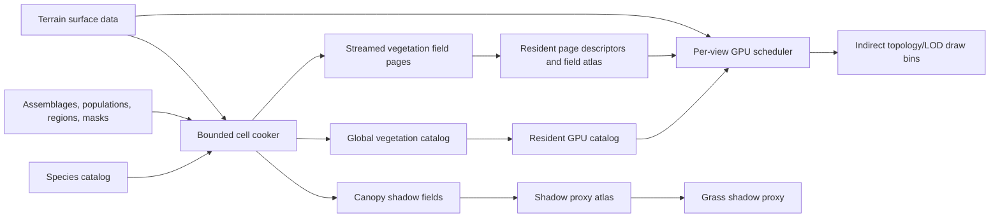

# Ground-Cover Architecture V2

## Status

This document defines the clean replacement architecture for Yarra's grass and dense decorative
vegetation. Its persisted placement slice, procedural-topology slice, and first live authoring slice
are now implemented.
The former card/ribbon renderer, compiler, authoring UI, database tables, runtime types, and shaders
have been deleted; there is no compatibility or conversion layer.

Investigation history, experiments, and provisional priorities remain in
[`GRASS_IMPROVEMENT_PLAN.md`](GRASS_IMPROVEMENT_PLAN.md). The Ghost of Tsushima notes in
[`GHOST_OF_TSUSHIMA_GRASS_TALK_NOTES.md`](GHOST_OF_TSUSHIMA_GRASS_TALK_NOTES.md) are reference
evidence, not a specification for this design.

## Executive decision

Build the replacement around three independent concepts:

1. **Species** describes what one renderable plant unit looks like and how it responds to light,
   wind, interaction, LOD, and shadows.
2. **Population** describes how instances grow: density, clumping, parent/child layout, scale and age
   distribution, rest orientation, species mixture, and competition.
3. **Spatial field** describes where populations are allowed and how strongly they contribute at a
   world position.

A species is not a placement pattern. A placement pattern is not a coverage mask. Keeping those axes
independent is the main architectural correction.

At runtime, resident pages contain compact population fields and references into one global species
catalog. A per-view GPU scheduler converts those fields into bounded candidate work, classifies each
candidate once, enforces explicit fixed budgets, emits compact instances into a small number of topology/LOD
draw bins, and finalizes indirect arguments. Procedural draw count is bounded by representation
families, not by page or species count; sparse authored meshes remain separately batched by mesh/LOD.

## Implementation checkpoint — 2026-08-31

### Architecture reset

The first procedural renderer iteration is rejected. It classified every candidate twice, used
non-indexed triangle-list expansion, gave a paired short-grass unit approximately twice the geometry
of a single blade, retained too many low-LOD roots, and reserved an 18 MiB instance arena before the
field was visually dense. It exposed placement and terrain contracts, but none of those rendering
decisions is an accepted foundation and no compatibility constraint preserves them.

The replacement renderer has these implemented hard properties:

- one GPU invocation classifies one logical candidate once;
- one tiny finalize invocation converts four atomic bin counts into indexed indirect arguments;
- all procedural draws use a static index buffer and compact 32-byte instances;
- the split short-grass topology shares the single-blade vertex-input budget instead of duplicating
  two complete blades;
- low-detail populations are stable nested subsets. The reference ribbon fixture retains one
  quarter of near roots, matching the area change of a two-times-wider tile rather than retaining
  three quarters of the near density;
- work items wholly below the high-LOD transition dispatch that nested quarter-lattice directly
  when their population supports it. Transition/boundary items retain the full lattice, so distant
  compute does not evaluate four roots merely to discard three;
- the four arenas contain 212,992 records, or 6.50 MiB total. Any capacity drop is a budget
  violation reported in the HUD, not a normal visual LOD;
- resident source buffers grow geometrically and are updated in place. Page-set changes no longer
  recreate buffers and bind groups after the warm-up high-water mark;
- low-frequency readback reports candidate evaluations, eligible/emitted counts, capacity drops,
  submitted indices, topology vertex inputs, upload bytes, retained source-buffer capacity, repacks,
  and actual buffer reallocations. Rendering never depends on this readback.

| Bin | Unique topology inputs | Submitted indices per instance |
| --- | ---: | ---: |
| single high | 18 | 48 |
| single low | 8 | 18 |
| split high | 18 | 42 |
| split low | 6 | 6 |

These are budgets to profile, not permanent artistic constants. The crucial invariant is that a
coverage-oriented paired unit does not silently cost twice as much as a single unit.

The first V2 vertical slice exists in three new crates:

- `yarra-vegetation` contains renderer-neutral species, topology, material, wind, representation,
  population, assemblage, field-page, validation, and deterministic world-lattice contracts.
- `yarra-vegetation-compile` contains deterministic source-mask composition plus a CPU reference
  placement implementation used to test page ownership and population competition.
- `yarra-vegetation-render` contains an independent Bevy/WGPU compute and indirect renderer. One GPU
  lane processes one candidate, a view-scheduling pass first compacts visible resident field work,
  and a one-invocation compute entry point finalizes four topology/LOD indexed draw bins. Candidate
  dispatch dimensions and draw counts are GPU-authored; the vertex shader consumes only index,
  vertex, and instance IDs plus generated storage data.

Two reference assemblages exercise the initial content requirements: a dry
parent/child tuft population and a competing narrow-grass/broad-leaf mixture. Tests establish that
adjacent pages produce the same roots as the corresponding larger world lattice, repeated masks
compose without source-order dependence, competition spends a shared local density budget, GPU
records retain their expected alignment, and all scheduler/generation/draw shaders pass Naga
validation.

Run the current V2 validation path with:

```sh
cargo run -p yarra-app-game -- --vegetation-v2-debug
```

The legacy renderer crate and its shaders have been removed. The default V2 view now renders
species-driven cubic Bezier ribbons through four indirect bins: single/split topology crossed with
high/low geometry. The split bins also provide an intentionally limited two-leaf approximation for
the initial broad-leaf fixture; it is not the final broad-leaf-cluster topology. Each species controls height,
width, tilt, bend, lateral curve/camber, longitudinal vertex distribution, pair spread, taper,
rounded normals, clump color variation, roughness, transmission, and root-to-tip AO. All geometry is
derived from vertex and instance IDs with no vertex streams. High geometry supports up to eight
sections per blade and low geometry up to three. Species-authored projected-pixel thresholds select
the bins. High vertices converge onto the exact low sample positions near the boundary, while a
stable nested rank collapses instances omitted by the low-density subset before the transition.

Resident world pages remain the source residency unit, but they are no longer synonymous with GPU
work. A first compute pass conservatively culls page-field work items and writes a compact queue plus
the indirect two-dimensional candidate dispatch. Whole pages are rejected only when all eight
corners of their relief-plus-vegetation bounds lie outside the same homogeneous side plane; an
approximate projected centre/radius test caused page-sized holes during camera rotation and was
removed. Only the compacted queue is classified and emitted. Each candidate is evaluated once and
appended to one bounded topology/LOD arena; a second full classification pass and the prototype
histogram planning pass no longer exist. Atomic append order cannot affect the image while demand is
within the declared arenas. Overflow is an invalid workload surfaced as a budget violation rather
than accepted as unstable degradation. CPU streaming keeps a rotation-invariant three-cell shell of compact vegetation fields and
their authoritative terrain relief resident around the viewpoint, matching the current 96 m GPU
procedural range for 32 m cells. Camera rotation therefore changes GPU work, not source residency.
This is the first production scheduler slice. When the shell changes, the current CPU bridge still
repacks resident descriptors and uploads their used ranges, but its GPU buffers are grow-only and
reused. Page-slot delta uploads remain a separate required streaming improvement. An optional
low-frequency telemetry path copies GPU counters and indirect arguments into a 144-byte
staging buffer. The next extraction frame maps it asynchronously, so the debug HUD can compare
source repacks, scheduled work, candidate evaluations, eligible/emitted bin counts, and capacity
drops without stalling or feeding CPU data back into rendering.

Press `X` to leave geometry and cycle through accepted roots colored by species, accepted
parent/child links, and all page-owned candidate outcomes. Those modes intentionally render simple
colored sticks so density, clump organization, field seams, flow, competition, species choice, and
terrain conformance remain inspectable without final geometry hiding placement errors. Outcome
colors are green for accepted, blue for stable density thinning, orange for coverage/competition
rejection, and magenta for an invalid surface sample. Cyan/magenta terrain-page boundaries and a
yellow centre normal make the shared streamed surface explicit. Halo candidates outside the page
remain hidden because they belong to a neighboring page and showing them would create false
duplicates at boundaries.

The terrain prerequisite is implemented as a real streamed contract rather than a vertex-shader
offset:

- project schema 12 includes endpoint-inclusive f32 source heightfields; scalar cell height remains
  a coarse source-cell descriptor, not a vegetation compatibility path;
- a new page payload variant stores quantized heights and octahedral normals. It was appended to the
  payload enum rather than changing the earlier discriminants;
- every page in a world space uses the same height quantization range, and the cooker validates
  shared source edges. Cooked edge heights and normals are tested for exact equality;
- edge normals use samples from neighboring source pages before quantization, avoiding one-sided
  lighting seams at independently streamed page boundaries;
- the terrain renderer builds a resident page mesh from those samples and publishes the same
  CPU-readable `StreamedTerrainSurface` used by downstream systems;
- render-space terrain sampling accounts for the current floating origin. The temporary character
  motor now grounds opted-in actors and movement-target indicators to that resident surface, and
  pointer destinations ray-march/refine against it rather than intersecting the old flat plane;
- each resident V2 field page joins the matching `StreamedTerrainSurface`. GPU placement rejects
  invalid samples, roots at the sampled height, and grows diagnostic ribbons in the sampled tangent
  frame.

The regenerated demo overworld uses a continuous 33x33-sample rolling heightfield per 32 m cell and
a small level area around the current character start. This is a controlled acceptance fixture,
not a production terrain-generation algorithm or editor sculpting tool. CPU height grounding is an
explicit narrow resolver, not a replacement for a later character controller or general physics
engine; it avoids making a physics dependency a prerequisite for validating streamed relief.

Persistence is now connected end to end. Project schema 12 and runtime schema 10 store one validated
generation-level `VegetationCatalog`; project cells store versioned `VegetationFieldPageData`; and
runtime page domain 9 streams the same terrain-independent fields. The regenerated demo contains
3,600 V2 field pages and zero legacy ground-cover definitions, masks, or runtime pages. A vegetation
payload never duplicates height or normal samples: the streamer attaches `StreamedVegetationFieldPage`
and the diagnostic assembles a resident page only when its terrain page is also present.

The next missing layers are delta-updated GPU page slots, a species-derived far/horizon
representation, a real broad-leaf-cluster topology, wind, interaction, distance-aware material
filtering, the new shadow design, and persistent V2 field authoring. Cards are not a V2 requirement
and will return only if a measured species-derived far representation justifies them.

## Content requirements derived from the references

The two supplied field references are not simply color variants of one grass shader.

### Dry flowing tuft field

The dry field contains:

- visible parent tuft centers;
- long, very narrow, highly curved blades;
- radial and tangential organization around each parent;
- overlap between neighboring tufts until they form a continuous mat;
- coherent variation at tuft scale rather than independent noise on every blade;
- a flattened, flowing silhouette that still reveals local growth centers.

This requires a two-level placement model: generate stable parent groups, then generate child roots
and rest directions relative to each parent. A global smooth direction field alone produces combed
swirls but cannot express discrete biological-looking tuft centers.

### Mixed green understory

The green field contains at least two visually distinct populations:

- a dense narrow-leaf grass with long crossing ribbons;
- a broader-leaf clustered or rosette-like plant around the sides;
- spatially coherent patches and boundaries;
- some overlap at transitions without doubling density everywhere;
- different leaf widths, topology, material response, and probable wind stiffness.

This requires composition and competition between population fields plus more than one procedural
topology family. Randomly choosing a different color or width for the current ribbon cannot produce
the broader plant.

## Non-negotiable invariants

- No Bevy entity, database row, or persistent gameplay identity per blade or decorative plant.
- No species/material payload duplicated into every streamed page.
- No procedural draw call per page, tile, clump, or species. Sparse authored meshes may require one
  batch per mesh/LOD, outside the dense procedural bins.
- No shader invocation serially expanding an entire dense cluster.
- No silent overflow. Accepted content/view profiles must report zero capacity drops; a nonzero drop
  is a test or runtime budget failure, not a supported quality mode.
- No default shadow path that renders all blades again for every light.
- No single shader full of divergent branches for every plant topology.
- Placement and LOD membership remain deterministic under camera motion and page streaming while the
  declared budget is valid.
- Memory, work queues, draw bins, authored-asset residency, and shadow proxies have explicit bounds.
- Near procedural geometry, far representations, bounds, materials, and wind all come from the same
  authored species definition.
- The design remains implementable with portable Bevy/WGPU compute, storage buffers, texture arrays,
  and indirect draws. Mesh shaders and bindless resources are not prerequisites.

## Conceptual authoring model

### Implemented minimal editor foundation

The World workspace now registers a dedicated `world.vegetation` tool and Vegetation window. This
is the first real authoring slice, not a second debug renderer:

- it reads the validated vegetation catalog through the mutable project-database worker into a
  separate session working copy, rather than editing the immutable runtime catalog;
- parameter edits validate the complete catalog before replacing that working copy;
- the preview joins the existing resident vegetation fields with the authoritative streamed terrain
  surface and drives the same `yarra-vegetation-render` compute/indirect path used by the game;
- changing the floating origin, resident page set, active world space, or draft revision rebuilds
  the preview scene deterministically;
- the window exposes population density, root placement, grouping source, Voronoi clump controls,
  rest-orientation weights, species envelope, ribbon/broad-leaf shape, group coherence, renderer
  diagnostic mode, workload isolation mode, and the fixed-budget counters needed to judge a preset;
- switching grouping families produces a compatible root-placement family and preserves catalog
  invariants rather than leaving an invalid half-converted preset;
- window state remains presentation state, while the declarative tool descriptor owns source-domain,
  pinning, command, overlay, and failure-policy contracts.

The working copy is deliberately session-local in this slice and is labelled as such in the UI.
It does not claim a derived-cook route that does not yet exist. The next editor layer must put the
same catalog draft behind typed undoable source commands, optimistic source revisions, bounded save,
and publish/adopt. Field/assemblage painting then extends this module with bounded resident-cell
working sets; it must not move parameter state into the generic World UI or create per-blade editor
entities.

### Species: what is rendered

`VegetationSpecies` is a globally reusable, immutable visual definition. It contains:

- a stable ID and editor identity;
- a representation stack for near, middle, far, and optional horizon use;
- topology parameters for each procedural representation;
- dimensional distributions and conservative bounds;
- a material profile and texture/LUT references;
- wind stiffness, drag, phase, and recovery parameters;
- interaction response;
- shadow classification and canopy contribution;
- optional authored mesh/impostor references.

One species can use several representations, but they must describe the same plant. If a card atlas
is selected, it is an LOD artifact of the species rather than an unrelated visual record.

Topology profiles are family-specific rather than one untyped bag of numbers. A ribbon profile can
author longitudinal vertex redistribution, high/low section counts, base/tip/control-point
distributions, width and taper curves, tilt, bend, lateral curve, twist, pair separation, and tip
style. A broad-leaf profile can author leaf count, crown radius, attachment angles, width/camber,
droop, and per-leaf scale. Families share curve helpers where useful but validate their own data.

### Representation stack: how a species changes with scale

Each species declares an ordered stack. A possible card-based stack is:

```text
near       ProceduralRibbonTuft(high topology)
middle     ProceduralRibbonTuft(low topology)
far        CardCluster(species impostor)
horizon    None or terrain macro contribution
```

or:

```text
near       ProceduralBroadLeafCluster
middle     ProceduralBroadLeafCluster(low topology)
far        CardCluster
horizon    None
```

Sparse pampas or flowers may instead use authored mesh LODs followed by an impostor. The stack also
declares how adjacent representations transition: topology morph, stable density reduction,
cross-family dither, or a combination.

Cards are not mandatory. A species may remain procedural through its visible range and terminate in
a terrain/canopy macro contribution, or use another measured proxy. The architecture requires an
explicit bounded distant strategy, not preservation of the deleted card implementation.

### Population: how it grows

`VegetationPopulation` references one species or a small weighted species palette. Its growth
contract is deliberately split into independent layers. A preset may expose them together in the
editor, but the runtime model must not collapse them into one overloaded "clump" mode:

1. **Root placement** determines the bounded candidate lattice: stratified roots or explicit
   parent/child roots.
2. **Grouping source** assigns every accepted candidate a common `GroupSample`: none, its explicit
   parent, or an analytic Voronoi feature point.
3. **Rest orientation** combines group-shared, radial, tangential, independent random, and field
   flow directions, followed by bounded per-root angular jitter.
4. **Species response** determines how strongly the shared group signal replaces per-blade
   randomness for height, tilt, bend, and lateral curve. Material color and future wind phase use
   the same stable group identity through their own independent response controls.

The population contains:

- target density and deterministic seed;
- stratified scatter or parent/child root placement;
- a `None`, `Parent`, or procedural `Voronoi` grouping source;
- parent density and spacing;
- child-count distribution and clump radius;
- radial falloff and background scatter fraction;
- scale, age, height, and color-variant distributions;
- a rest-direction rule with independent signed source weights and angular jitter;
- optional exclusive competition group;
- optional local density and direction-field channels.

The initial rest-direction rule is a weighted blend of compact sources:

- independent random direction;
- radial direction away from the parent;
- tangential direction around the parent, including signed swirl;
- an authored or generated world-space flow field;
- terrain downhill/uphill direction;
- a fixed authored direction.

Growth orientation and wind direction are separate. Wind deforms the authored rest shape; it does
not define where the plant originally grew.

Every grouping source resolves to this renderer-independent sample:

- stable 32-bit group key;
- world-space centre;
- normalized centre distance and centre-to-root direction;
- a boundary influence that fades group forces near ambiguous Voronoi borders;
- a bounded local density-retention multiplier.

Voronoi membership is an analytic population signal, not a persistent object or a render unit. For
each candidate root, a deterministic world-space 3x3 neighborhood search selects the nearest and
second-nearest jittered cell feature points. The nearest point supplies group identity and centre;
the nearest/second-nearest distance gap supplies a boundary influence. Authored spacing, feature
jitter, boundary softness, root attraction, centre/edge retention, falloff, and group-to-group
density variation control placement without allocating clump records. Root attraction fades at
soft boundaries so roots do not visibly snap across the procedural cell border.

The expected number of stratified roots associated with a Voronoi clump is approximately
`maximum density * clump spacing^2`; it is a derived cost, not an independently generated child
count. Content that requires an exact bounded number of leaves around a visible centre uses
parent/child placement instead.

Independent orientation controls consume the sample: signed shared, radial, tangential, and field
weights; non-negative residual random weight; and a bounded angular jitter. Independently authored
species response values consume the same stable group key for height, tilt, bend, lateral curve,
material, and later motion. One overloaded scalar must not control all of those channels implicitly.

Explicit parent/child growth remains useful for botanical tufts with a bounded child count and a
visible parent centre. Its parent is simply another implementation of `GroupSample`; all downstream
orientation, shape, material, motion, and diagnostics remain shared with Voronoi groups. Voronoi
clumps instead organize an otherwise continuous root population without storing or serially
expanding a list of children. Both models are deterministic in world space and must remain seamless
across streamed page boundaries.

Ungrouped grass is the simplest case: one root per stratified cell, zero group influence, an
authored blend of random and field-aligned rest direction, and optional competition. Large and small
grass use the same grouping interface. Size is a species/topology property, not a reason to fork the
placement architecture.

### Assemblage: which populations coexist

`VegetationAssemblage` is the reusable preset painted into the world. It contains several
populations.

Populations without a competition group are independent overlays. This is appropriate for dense
base grass plus sparse flowers. Populations in the same competition group form a categorical choice:
their sampled weights select at most one population at a location. This allows narrow grass and
broad-leaf ground cover to exchange dominance without doubling the full density at their boundary.

Each assemblage declares a finite field schema. Base coverage is mandatory; optional named channels
may drive density, flow, or member weights. A region stores only the channels declared by its
assemblage, and the cooker rejects missing or incompatible bindings. This gives the mixed-understory
workflow explicit population control without creating an arbitrary runtime graph.

The initial model intentionally avoids an arbitrary ecological rule graph. Independent overlays plus
small exclusive groups cover the target references while remaining deterministic and cheap.

### Regions and spatial fields: where it grows

Regions continue to provide editable world-space masks, density multipliers, and organization. A
region references an assemblage rather than one visual. The cooker rasterizes active regions into
page-local fields used by the populations in that assemblage.

Useful field channels include:

- coverage/weight;
- density multiplier;
- optional species or population mixture weight;
- optional two-component rest-flow direction;
- optional age/wetness/season value when a real art workflow requires it.

Channels should be added for demonstrated content needs, not as a generic material graph stored in
every page. Direction fields are stored as signed vectors, interpolated component-wise, and
renormalized; scalar angles would create interpolation seams around zero/360 degrees.

## Source, cooked, and runtime separation



### Global cooked catalog

The cooker publishes globally de-duplicated tables for:

- species;
- topology profiles;
- material profiles;
- growth-pattern profiles;
- representation stacks;
- texture/LUT atlas allocations;
- authored mesh and impostor references.

Resident pages use compact catalog indices. A page never carries another copy of a species structure
or its card artwork.

### Streamed field page

A `VegetationFieldPage` contains only spatially varying data:

- page origin and extent;
- active population-field descriptors;
- atlas coordinates for coverage/density/flow masks;
- references to the relevant global population/assemblage records;
- a reference to terrain height/normal sampling data;
- conservative population bounds;
- optional sparse authored-asset seed blocks;
- compact canopy shadow bands.

The runtime should upload resident pages into descriptor arrays and texture/buffer atlases. Compute
dispatches iterate a resident descriptor array instead of rebinding and dispatching once per page.

Coverage-field mip chains carry both mean coverage for density and maximum coverage for conservative
work rejection. Ordinary filtered mips alone cannot serve both purposes. Field-atlas slots are
reference-counted and recycled as pages leave residency.

### Surface sampling contract

Every generated root needs a consistent surface sample:

```text
height, geometric normal, material/surface tags, validity
```

The generator should consume the same terrain representation used by rendering or a cooker-produced
derivative with defined error bounds. Flat per-cell height is not an acceptable final contract.

Surface tags can later exclude rock, water, paths, or incompatible soil without making the grass
renderer depend on gameplay objects.

### Canopy shadow field

Dense procedural populations compile into a small fixed number of height bands. Each band stores
coverage/density and representative/top height relative to terrain. This field drives broad grass
shadow casting without expanding blades.

Tall sparse authored assets do not need to contaminate the dense canopy height. They use simplified
ordinary mesh shadows or a separate sparse band.

## GPU frame architecture

### Overview


This is a per-view pipeline. Multi-view support owns separate view work queues and output arenas while
sharing resident catalogs and spatial fields.

### Stage 1 - build the visible work queue

One lane evaluates a page/population microtile, not an entire cluster full of plants. It:

- rejects the microtile against the view;
- produces a `PopulationWorkItem` with an implicit deterministic candidate sequence;
- selects full or nested-quarter candidate enumeration conservatively from the entire work-item
  bound; and
- atomically contributes the selected candidate count used to write the indirect generation
  dispatch.

Microtiles come from a world-space grid so page boundaries do not create placement seams.
Parent/child patterns inspect the small parent-cell halo that can influence the page, then assign
ownership by the child root's world-space microtile. This prevents duplicates and clipped tufts at
streaming boundaries.

### Stage 2 - classify and emit once

One compute lane owns one prospective render unit. It:

1. derives a root from the population's stable placement sequence;
2. resolves its `GroupSample`, applies bounded group density retention, and constructs its rest
   orientation;
3. samples spatial coverage and competition weights;
4. selects a species from the population palette;
5. samples terrain height, normal, and surface tags;
6. rejects invalid or incompatible positions;
7. performs exact visibility and projected-size classification;
8. calculates nested density/LOD membership and transition weight;
9. atomically reserves one slot in its selected bin and writes one compact render instance.

There is no second count/fill traversal and no transient candidate record. Expensive high topology
is admitted inside a deterministic camera-local radius derived from the worst overlapping authored
root density, the fixed topology-bin capacity, and safety headroom. A stable outer annulus morphs to
the exact low topology, and farther roots enter the low bin rather than being discarded. This bounds
the current high bins without making atomic append order an admission policy. Exact eligible,
emitted, and dropped counts verify the contract. If a future content profile cannot maintain zero
low-bin drops without an unreasonable arena, the scheduler must gain deterministic pre-evaluation
or rank resolution; silently accepting atomic overflow is forbidden.

Wind and interaction are evaluated once per emitted procedural unit and packed into the instance
when that saves repeated per-vertex work. Shape distributions remain in the indexed species/topology
tables.

The current storage contract is:

- no transient candidate arena;
- 32 bytes for an ordinary procedural instance;
- 6.50 MiB for the four current topology/LOD arenas.

The 32-byte record is not a license to duplicate work into more instances. Species distributions and
material data remain indexed catalog data rather than repeated values.

A typical instance needs root position plus species index, stable seed, packed surface normal,
LOD/transition and clump-variant data, and a compact deformation payload. Height, width, rest-shape
distributions, material profile, and bounds remain indexed catalog data rather than repeated values.

### Stage 3 - finalize and draw

One single-invocation dispatch clamps counters for safety and writes `index_count`, `instance_count`,
`first_index`, `base_vertex`, and `first_instance` for each draw bin. The renderer binds one static
index buffer and issues four indexed indirect draws. Additional vegetation depth or shadow passes
must reuse the same generated instance stream unless a measured view-specific requirement proves
otherwise.

The quarter enumeration is not a page-local “take the first 25%.” Uniform populations select one
deterministically rotated cell from each world-aligned 2x2 lattice block. Parent/child populations
select one deterministically rotated child from each group of four when the authored child count is
divisible by four. The same nested rank drives the transition and draw collapse, so dispatch
reduction does not substitute a different set of roots.

## Draw bins and shader families

A draw bin is keyed by procedural topology family and geometry LOD, not by page or species. Species
parameters and material atlas locations are indexed from the instance.

Initial topology families:

1. **Ribbon blade/pair** - one long blade or the folded two-short-blade form.
2. **Ribbon tuft** - a fixed small number of related narrow leaves generated from one render unit.
3. **Broad-leaf cluster** - several wider cubic leaves emerging from a crown/rosette.
4. **Stem and head** - optional procedural stem plus textured/low-poly flower or seed head.
5. **Optional card cluster/impostor** - one candidate far representation for dense procedural families.
6. **Authored mesh asset** - pampas-like plants, lilies, flowers, and other sparse decoration.

Each procedural family owns a small focused shader and its explicit high/low topology mapping. It is
acceptable to share curve/material helper libraries. It is not desirable to put all families behind
one vertex-shader switch with unrelated control flow.

With three procedural families and two geometric LODs, draw count remains a small constant even if
the world contains dozens of species.

## Procedural plant unit

A render instance represents the smallest unit that a topology shader expands efficiently; it does
not have to equal one botanical plant.

- A long-ribbon instance may be one blade.
- A short-grass instance may fold the same vertex budget into two blades.
- A ribbon-tuft instance may generate several related leaves.
- A broad-leaf instance may generate an entire small rosette.

Leaves generated by one multi-leaf instance derive separate local shape and phase hashes so the
memory saving does not force them to animate as a rigid fan.

Population parent/child generation controls the world pattern. Topology controls local geometry at
one accepted root. Keeping them separate prevents a hard-coded "twelve blades per carrier" from
simultaneously defining density, clumping, geometry, wind, and LOD.

## LOD and density

LOD is driven by projected error/size with hysteresis and stable dithering, not fixed distance alone.
Projected size is the conservative screen-space envelope of authored height and horizontal reach,
not only a surface-normal-aligned root-to-tip segment. The latter collapses in overhead views even
when bent and tilted blades retain a large visible footprint. Work scheduling, candidate
classification, and draw-side morphing use the same envelope contract. Runtime reach is clamped to
the cubic-Bezier control hull plus root offset, grazing-angle width expansion, and maximum wind
displacement, so an undersized authored culling bound cannot make pages vanish at view edges.
Each transition handles three independent signals:

1. **Shape:** high topology morphs toward the exact surviving low topology.
2. **Population:** stable nested rank removes candidates before the lower-density tier takes over.
3. **Representation:** if the topology family changes, adjacent representations cross-fade with
   matched bounds, color, wind envelope, and clump identity.

The population sequence is nested: every lower-density set is a subset of the denser set. Surviving
roots never move. Cross-family transitions may use alpha/dither, but both representations use the
same stable seed and species definition.

Shape and population do not share one scalar. Shape uses projected blade envelope. Population uses
the square root of the projected ground-cell area implied by authored roots per square metre, with
surface-normal foreshortening. This preserves ground coverage from overhead while allowing density
to fall when roots become subpixel or overlap at grazing distance. The classify pass quantizes the
current population target into the existing 32-byte instance seed word; high topology can therefore
collapse only roots outside that exact nested target before the low topology takes over. Direct
quarter-lattice scheduling is permitted only when both geometry and population are conservatively
inside their low plateaus.

Any distant artifact should be baked or generated from the species' real procedural geometry and
material profile. The deleted unrelated R8 silhouette recipe must not return as a source of truth.

## Material architecture

The material system should use compact shared LUTs/atlases rather than a unique material bind group
per species.

### Color LUT

A small 2D color lookup uses:

- X: clump-level palette variation;
- Y: root-to-tip position;
- RGB: authored base color.

All leaves in a clump receive a related X coordinate. This creates coherent patches rather than
per-blade confetti.

### Surface-profile LUT

A second small 2D lookup uses:

- X: left-to-right position across a leaf;
- Y: root-to-tip position;
- channels: diffuse/vein multiplier, perceptual roughness, transmission, and authored AO.

This consolidates the useful idea behind Ghost's 1D/2D textures without requiring the same exact
resource layout. Constant or analytic species can use a tiny default tile. Broad leaves may also
reference an optional detail texture-array slice when a LUT cannot express their markings.

### Lighting stability

- Procedural families generate analytic rounded normals.
- Useful near-field curve/tangent detail may be retained.
- Normal detail blends toward a stable species/clump normal as projected size shrinks.
- Roughness increases as normal/coverage variance becomes subpixel.
- Edge-on thickening is limited by projected pixel width and authored per species.
- Root-to-tip AO remains stable and non-temporal.

## Wind and interaction

### Shared wind field

Wind is a simple world-space field shared by CPU and GPU consumers. Its minimum useful output is a
2D direction and scalar strength/gust value. A layered scrolling noise implementation is suitable,
but the public contract is sampling behavior, not a particular noise function.

Species supplies stiffness, drag, bend distribution, phase range, and vertical response. The
instance seed supplies per-unit phase. The topology shader may vary response along the leaf so motion
reads as sway rather than translation.

Rest growth direction, wind direction, and interaction displacement remain separate inputs.

### Interaction

The existing bounded actor/capsule field is a reasonable first dynamic source. The new pipeline
evaluates it once per accepted procedural unit and packs a small control-point displacement. Species
controls maximum bend and recovery.

Persistent trails or cut vegetation require a separate low-resolution world field. They should not
turn decorative instances into gameplay entities.

## Shadows

The architecture separates three problems:

1. **Receiving external shadows on vegetation.** Establish a measurable V2 receiver path. The
   deleted filtered receiver cache is prior evidence, not an implementation requirement.
2. **Casting broad grass density.** Render a coarse canopy/terrain proxy into directional shadow
   views. Sample compiled canopy height bands, displace the proxy, and use world-stable stochastic
   depth/alpha so shadow filtering integrates average density.
3. **Casting fine local blade detail.** Optionally derive a short-range screen-space shadow mask from
   separate opaque and vegetation depth information.

The proxy resolution is independent of terrain tessellation unless experiments prove that reusing
terrain vertices is sufficient. This avoids making coarse terrain topology the permanent quality
limit for grass shadows.

The proxy may sample the shared low-frequency wind field to move the broad shadow mass, but it does
not reproduce per-blade phase. Fine animated silhouettes belong to the optional screen-space layer.

A full procedural-blade shadow pass is useful as a quality reference and perhaps for rare hero
lights. It is not the default architecture. Sparse authored assets use ordinary simplified shadow
LODs where affordable.

Screen-space detail is optional because integration cost may be substantial. A viable design likely
needs opaque receiver depth preserved separately from alpha-tested vegetation depth; otherwise the
frontmost grass replaces the ground surface needed by the shadow trace.

## Authored field assets

Non-interactive flowers, lilies, pampas, and similar assets use a compact static GPU stream rather
than ECS entities.

Placement uses the same population, competition, surface, and deterministic seed rules as procedural
plants. Accepted transforms are generated once when a page becomes resident (during cooking, CPU
upload, or a one-time GPU job), then per-view GPU culling and LOD feed indirect asset draws.

The record contains only what rendering needs: transform, catalog/mesh identity, bounds/LOD data,
seed, and small material/wind variation. Assets are released with their source pages. Residency range
is derived from view distance, preload margin, and largest asset bounds; Ghost's 3x3 neighborhood is
evidence for bounded residency, not a literal constant.

Gameplay plants remain ordinary objects layered over the decorative population and may suppress
decorative coverage locally.

## Streaming and memory model

### Persistent resident data

- one de-duplicated species/topology/material catalog;
- resident page descriptors;
- coverage/density/flow field atlas pages;
- terrain surface sampling pages;
- canopy shadow fields;
- sparse authored-asset transforms.

### Per-view transient data

- visible population work queue;
- compact procedural instance arena;
- indirect arguments and diagnostics.

The current four-bin arena is an explicit 6.50 MiB device/content-profile budget with exact counters.
Pages do not own worst-case visible-instance memory. A transient candidate/rank arena is deliberately
absent from the classify-once path; it may be introduced only if a demonstrated workload cannot
maintain zero drops through bounded residency and stable population LOD.

Global batching remains the baseline because Bevy's main render phases already favor preparing GPU
work before the depth/color passes. A Ghost-style compute/graphics ping-pong ring should be adopted
only if a prototype proves that its overlap and memory wins exceed the extra render-graph passes,
synchronization, and draws on target Apple GPUs.

## Performance contract

The replacement is considered architecturally successful only if it satisfies these measurable
properties:

- CPU work scales with resident pages and catalog changes, not visible plant count.
- Candidate classification has one lane per candidate and no serial per-cluster inner expansion.
- Coverage, competition, visibility, and LOD are classified once per frame candidate.
- Procedural draw calls scale with active topology/LOD bins, not pages or species; sparse authored
  mesh batches are measured and budgeted separately.
- Default procedural instance payload is 32 bytes, with 48 bytes requiring evidence.
- Global catalog records and textures are uploaded once and referenced by index.
- Accepted profiles produce zero capacity drops. Overflow is an observable budget failure rather
  than a supported, order-dependent quality reduction.
- Near/middle/far transitions preserve roots and do not expose rings or population steps.
- Shadow cost is primarily proxy resolution plus screen size, not full blade count times light count.
- HUD/debug tooling reports resident catalog/field bytes, transient arena bytes, theoretical
  candidates, classified candidates, emitted instances, bin budgets, rejected ranks, draw counts,
  and platform GPU timings. Exact vegetation pass timestamps are required where the backend exposes
  timestamp queries; Metal captures use Xcode/Metal tooling plus exact submitted-work counters.

Exact millisecond and memory budgets require the target device and scene definition. They should be
set during the first vertical slice rather than invented in the data model.

## How the reference fields map onto the design

### Dry field assemblage

```text
Species: DryFineRibbon
  near/mid: narrow high-curvature ribbon topology
  distant: reduced procedural roots, proxy, or species-derived artifact selected by measurement
  material: orange/brown clump palette, low gloss, strong root darkening

Population: DenseDryTufts
  parent/child placement
  many children in a broad radius
  radial + signed tangential + random rest direction
  clump-level height/color/age variation
  overlapping parents plus a small background-scatter fraction
```

The tuft field defines the visible pattern. Wind adds coherent motion but does not create the tuft
orientation.

### Mixed green assemblage

```text
Exclusive group: understory_base
  Population A: ThinGreenRibbon, dense tufted scatter
  Population B: BroadLeafCluster, clustered/rosette scatter

Independent overlay group
  Population C: optional sparse flowers or authored accents
```

Painted weights exchange dominance between A and B. Their boundary can overlap softly without both
populations appearing at full density. Each uses its own topology, material LUT, wind stiffness, and
LOD stack.

## What to preserve and what to replace

### Preserve as concepts or infrastructure

- anonymous deterministic decorative coverage;
- region-mask authoring and bounded cell compilation;
- content-addressed cooking/publication and page streaming;
- stable IDs and deterministic hashes;
- GPU-driven indirect rendering;
- alpha-tested depth and receiver-cache techniques as historical candidates, reintroduced only if
  V2 measurements justify them;
- the bounded interaction-stamp concept;
- global batching unless a target-hardware experiment beats it.

### Replace in the V2 runtime

- card-only `GroundCoverSpecies` as the universal species type;
- `GroundCoverBladeRecipe` as a card-only source disconnected from near geometry;
- one visual per preset;
- render-sized `GroundCoverCluster` records generated for every nonzero mask sample;
- page-local duplicated species buffers;
- one GPU dispatch per page bind group;
- one cluster lane serially looping carriers and twelve ribbons;
- the duplicated count/cull classification;
- three fixed 96-byte instance arrays;
- hard-coded near/middle/far shaders and one global card/ribbon toggle;
- the R8 silhouette atlas as the only far-material data;
- the smooth clump field serving simultaneously as growth pattern, facing, color, and motion identity.

## Clean-break strategy

V2 is the only vegetation architecture. There is no authored legacy world content to preserve, so
the old renderer, source schema, runtime pages, editor tools, compiler, and migration code were
deleted together. Schema mismatches are rejected instead of translated; demo databases are
regenerated from the current V2 contracts. Future schema changes must be justified by V2 content,
not by compatibility with the discarded card/preset model.

## Implementation slices

### Slice A - catalog, page fields, and debug placement

Status: **placement foundation complete; content acceptance ongoing**. Pure catalog/page contracts, source-mask composition, world-lattice uniform
and parent/child placement, local competition budgets, stable species selection, validated
height/normal/validity surface fields, streamed-terrain conformance, global debug catalog upload,
GPU candidate generation, indirect finalization, and placement diagnostic drawing exist. Visual
acceptance of both reference patterns and per-reason GPU counters remain.
Accepted/rejected outcome and parent-link views now exist with a persistent current-mode/color
legend; per-reason GPU counters remain. The game-side V2 fixture outlines nearby terrain pages for
surface/seam inspection.

- Define V2 source-independent cooked/runtime types.
- Upload one global catalog and resident descriptor/field atlases.
- Implement uniform and parent/child placement with terrain conformance. **Initial diagnostic path
  is connected to production page streaming.**
- Implement competition groups and stable species selection.
- Render debug points/lines for roots, parents, directions, weights, and rejected candidates.
- Reproduce the dry tuft pattern and mixed-species boundary without final shading.

### Slice B - scheduler, bins, and two procedural families

Status: **scheduler and first continuous procedural LOD implemented; profiling in progress**. Four
fixed topology/LOD bins, 32-byte procedural records, species-driven cubic ribbons, split two-blade
units, GPU-authored visible work/dispatch, and indexed indirect draw finalization are implemented.
The rejected count/plan/emit prototype has been replaced by one classify-and-emit invocation per
candidate followed by a one-invocation finalize pass. Split topology consumes no more unique vertex
inputs than single topology, the reference low/far populations are stable quarter-density subsets,
and the instance arena fell from 18 MiB to 6.50 MiB. High geometry converges onto low-section samples
and high-only density members collapse at the boundary. Zero capacity drops are required; the HUD
labels a nonzero value as a budget violation. Source buffers now grow geometrically and update in
place, so ordinary residency revisions do not recreate resources after warm-up. Delta-updated page
slots, a dedicated broad-leaf cluster family, and controlled target-hardware measurements remain.
The debug HUD supplies low-frequency exact work, topology, memory, upload, and allocation counts;
named schedule, generate, finalize, and draw spans expose GPU time on timestamp-query backends and
CPU recording time everywhere. Exact pass-level GPU timings still come from Metal/Xcode capture on
Metal, and the HUD labels that limitation rather than presenting CPU recording time as GPU work. A
`P` diagnostic cycle provides fixed-camera full, frozen-draw, compute-only, and scheduler-only
workloads so the target Metal overlay can still produce controlled component baselines.

The first four-mode M2 Max capture measured the full fixed-camera workload around 3.7-4.2 ms and the
schedule-only scene around 3.6 ms. The comparison indicates that the current candidate compute is a
minor component while raster/fragment behavior is the larger vegetation-side optimization target.
These overlay values are directional rather than substitutes for a Metal capture. The capture also
found an overhead regression: the old root-to-surface-normal-tip metric selected low geometry and
quarter population from above. Full authored height/reach envelopes now drive geometry decisions,
work-item bounds carry maximum height and horizontal reach explicitly, and population density uses
projected ground-cell area independently. Low topology can therefore remain cheap without making an
overhead field sparse.

The reference content now separates silhouette and ground coverage. Taller parent/child ribbons are
more lateral and curved, while an independent 18-unit/m2 short population expands every unit into
two widely separated five-section blades. This is the intended use of the folded/split topology:
short grass increases coverage efficiently without forcing every tall species to double or relying
on one extreme global density value.

- Implement bounded work allocation, one-lane candidate classification, bin budgeting, compact
  emission, and indirect finalization.
- Implement ribbon/pair and broad-leaf-cluster families with high/low topology.
- Add zero-drop capacity stress tests and controlled platform GPU captures.
- Establish actual instance size and arena budget on the target hardware.

### Slice C - far LOD, material, and wind continuity

- Extend the implemented topology morph and nested density into a measured far transition.
- Compare reduced procedural roots, field proxies, and optional baked artifacts derived from the
  species definition.
- Add color and surface-profile LUT atlases.
- Add shared wind sampling, per-species response, per-instance phase, and interaction.
- Validate close, overhead, grazing, and moving-camera views.

### Slice D - scalable shadows

- Produce a full-blade directional reference.
- Implement canopy bands and a separate proxy grid.
- Tune stable dither/filter behavior across cascades and low sun.
- Prototype separate vegetation depth and screen-space fine shadows.
- Retain only the pieces that win quality/performance comparisons.

### Slice E - authored assets and V2 editor

- Add authored mesh/impostor representation and bounded static GPU streams.
- Extend the implemented live species/population profile editor with typed undo, persistence,
  assemblage editing, and mask previews.
- Add native V2 field authoring through bounded resident-cell working sets.
- Publish V2 pages through the existing content-addressed world pipeline.

## Prototype gates and unresolved choices

These require evidence without changing the conceptual model:

- 32-byte versus 48-byte procedural instances;
- whether a future heavy content profile needs a deterministic pre-budget/rank stage despite its
  candidate-memory and extra-dispatch cost;
- one multi-family instance arena versus a few family-specific arenas;
- separate proxy grid versus raised terrain vertices for broad shadows;
- feasibility and total cost of separate vegetation depth plus screen-space shadows in Bevy 0.19;
- generated multi-angle impostors versus simpler card clusters per family;
- whether authored-asset streams should become an engine-wide growth/foliage service.

None of these choices requires returning to page-local species data, serial cluster expansion, or a
single universal topology shader.

## Acceptance scenes

The first architecture review should use fixed, reproducible scenes:

1. dry overlapping tufts viewed overhead, at grazing angle, and under animation;
2. thin grass and broad-leaf populations exchanging dominance across a soft boundary;
3. the same mixed field with sparse flowers/authored assets;
4. near-to-horizon movement through every representation transition;
5. low-sun broad grass shadows plus local blade detail at a field edge;
6. severe capacity pressure with no page-shaped holes or root reshuffling;
7. page load/unload while the camera crosses world-cell boundaries;
8. frozen and animated wind under glossy/rain-like lighting.

For each scene capture visual output, emitted counts by bin/species/population, rejected stable ranks,
resident and transient memory, draw/dispatch count, compute/vertex/fragment timing, shadow timing, and
temporal stability.
