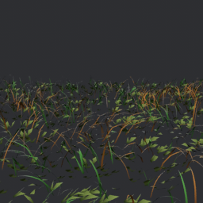
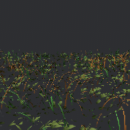
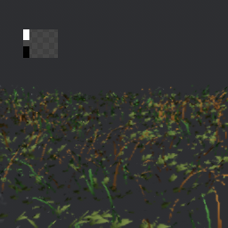
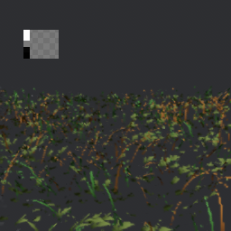

# Grass detail loss during Temporal strafing

The user isolated the blur to grass and confirmed it persists with grass wind disabled.
The native image fixture reproduces this at the same final camera pose, with identical
grass instance records and frozen wind/lighting. Ordinary camera motion does not reset
history. It occurs with both prepared and procedural blade geometry.

These are 128×128 inputs reconstructed to 256×256, after the exposure correction below:

| Stationary | Immediately after sideways motion |
| --- | --- |
|  |  |

The stationary image resolves narrow blades which become fragmented/soft during motion.
This is a reproducible image-quality failure, not a conclusion drawn from an FPS counter.
The small fixture establishes the failure class, not the exact severity in the full game.

## What was isolated

- Wind is off; the same final camera position is used for both captures.
- The final generated instance multisets are exactly equal, including LOD fields.
- Disabling prepared blade geometry does not eliminate the loss.
- An unlit shader comparison also retains the loss, so moving specular highlights,
  shadow sampling and the custom lighting response are not required to reproduce it.
  The temporary unlit shader override was restored after capture.
- History is not repeatedly resetting during the strafe.
- The earlier final-depth reprojection test agrees with recorded grass motion to about
  0.001 input pixel at its 95th percentile.
- A finer analytic pattern also confirms native motion scale and sign. At 2.8× the
  original probe frequency, horizontal RMSE is 0.076813 with the current convention,
  versus 0.171267 with double motion, 0.174411 with half motion, and 0.161280 with the
  opposite direction. Dynamic input sizing does not require a different conversion.

The leading remaining explanation is instability of thin-blade pixel coverage and
visibility during temporal reconstruction. It is not yet a demonstrated per-blade
occlusion diagnosis. The tests do not establish that every possible grass motion case
is correct or that there is no further integration improvement available.

## Rejected experiment

A temporary R8 reactive mask was written with grass colour/motion. It biased only moving
grass toward the current frame, ramping over 0.25–1 input pixel/frame. At strength 0.35 it
did not restore the missing blade detail; at strength 1 it increased jagged/sparse samples.
All mask resources, shader outputs and backend changes were reverted. There is no new
reactivity setting or extra grass attachment in the game.

75% input was also tested and still lost substantial detail during the strafe. A 100%
input run after correcting exposure retained more detail but still differed visibly
from its stationary image. Neither is being presented as a complete blur fix or as a
performance result. The 75% and 100% runs used different exposure hints, so they are not
a controlled measurement of resolution alone.

## Exposure correction retained

Grass and Bevy PBR already multiply lighting by camera exposure before producing the
HDR colour passed to MetalFX. The previous backend enabled MetalFX auto exposure anyway,
giving reconstruction a different brightness hint from the tone mapper.

Apple's exposure visualization (`MTLFX_EXPOSURE_TOOL_ENABLED=1`) showed the mismatch:
the checkerboard was dark, with sampled grey cells around 63–71/255. Disabling the second
auto exposure and supplying an explicit R16Float 1×1 texture containing 1.0 brought those
cells to roughly 112–124/255. The texture is initialized once and retained with the scaler.
The native pre-exposure remains 1.0 because the input contract is camera-exposed HDR.
This matches [Apple's exposure guidance](https://developer.apple.com/videos/play/wwdc2025/211/).

| Previous automatic hint | Explicit unit hint |
| --- | --- |
|  |  |

This corrects an input mismatch, **but does not fix the reported grass blur**. Do not
describe it as a grass-quality improvement. Native HDR/reset and analytic reconstruction
checks pass with the unit exposure. No power or frame-time improvement was measured here.

## Reproduction

```sh
YARRA_TEMPORAL_IMAGES=/tmp/yarra-temporal-grass \
  cargo test --release -p yarra-vegetation-render --features upscaling/metalfx \
  temporal_grass_detail_during_strafe -- --ignored --nocapture
```

The test writes PPM images without adding an image-encoding dependency. Optional
`YARRA_TEMPORAL_INPUT_PIXELS=192` selects 75%; `256` selects native-size input. The fixture
asserts matching populations, native Temporal availability and uninterrupted history.
It is an image diagnostic, not a passing quality threshold.

The analytic probe accepts `YARRA_PROBE_MOTION_GAIN` and `YARRA_PROBE_FREQUENCY` for
investigation. Non-default overrides report errors rather than enforce the nominal
quality thresholds. Without overrides, the existing regression assertions still apply.
